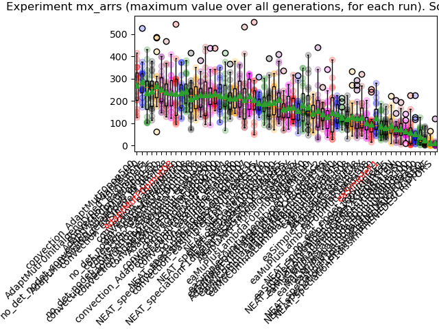
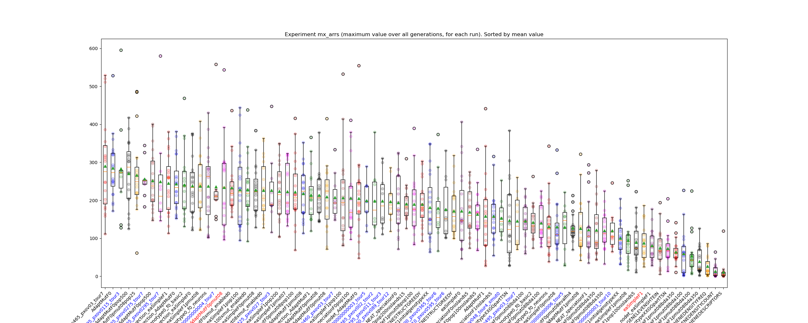
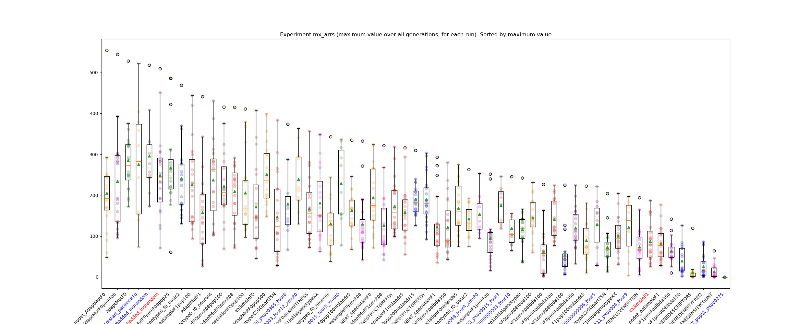

# **GECCO 2026: Automated Design Competition**

[Competition](#competition)

[Working Area](#working-area)

[Results](#results)

[Source Index](#source-index)

## Installation instructions

0. Follow the instructions on the [Official Competition Website](https://framsticks.com/gecco-competition) ([Archive link - 2025/03/24](https://web.archive.org/web/20250324230252/http://www.framsticks.com/gecco-competition)) to install Framsticks.
1. Clone the repo (`git clone https://github.com/KebabRonin/Disertatie`)
2. (optional) Add your local path to the framspy folder to `config.yaml` file in the parent of `src` folder.
This is used to import DissimMeasure, gain access to `frams.GenMan`, etc.., and so `FramsticksLib` doesn't break when imported.
*Note: the framspy folder in this repo may be outdated, but it's frozen for ease of development. If you want to fork this repo, you should update the `framspy` folder, as described in the instructions at step 0.*
```yaml
# ...
experiments:
  framspy_path: <YOUR_PATH>
```
3. (optional) Update `FramsticksLib().end()` function to raise `EOFError` instead of calling `sys.exit()`, so the `runExperiment` script can print some additional information about RAM usage. 
4. Run the following command:
```bash
cd Disertatie
# Make sure you're in the src/../ folder.
python -m src.runExperiment -path <PATH_TO_FRAMSTICKS> -sim "eval-allcriteria.sim;deterministic.sim;recording-body-coords.sim" -evalfn "3" -genformat "0" -initialgenotype random -opt COGpath -popsize 20 -wHist_cacheActive 1 -flibclass wHist -algorithm MAPElites -wHist_ESalgo none -restart_method soft_perturb_best -restart_patience 100  -novelty_sel random_meta -tournament 50 -generations 100
```

### Script Table of Contents
Some scripts which are available to run, from the `Disertatie` root folder:

```bash
cd Disertatie

# Run an experiment (use argument -h to see the options)
python -m src.runExperiment <arguments>

# Run multiple experiments based on a configuration (which you should define in src/runExperimentsQueue.py)
python -m src.run_more

# Utility for queuing multiple run_more.py calls
python -m src.runExperimentsQueue

# Draw graphs for all local experiments. Redo will re-crawl the logs generated with the run_more.py script.
python -m src.collect_data --redo

# Crawl the files created by collect_data to import them in an optuna database.
python -m src.load_optuna

# Run optuna hyperparameter optimisation.
# If new parameters are added, you'll need to update the distributions in get_algorithm_specific_params(trial, algorithm) and load_optuna.py
python -m src.optuna_study
```
## Algorithm Description

The algorithm extends the `AdaptMut` submission from prior years:
* *Triggered Hypermutation:* If stagnation is detected (no fitness increase > 1% in the last 5 generations), the number of applied mutations is increased (max range 1-5)
* The initial population is randomly generated
* Infeasible genotypes are not evaluated (detected with `framsLib.isValidCreature(genotype)`), so they don't count towards the `totalevals` anymore. This saves ~300 evaluations on average.
* *Soft restart mechanism:*
	* patience=10 generations
	* new population = \[25% clone best individual and mutate 0-4 times\] + \[75% randomly generated individuals\]
* *Genotype Cache:* a cache of all evaluated individuals is maintained. It is used to skip evaluation of already evaluated individuals.
* *Dynamic mutation probabilities:* Before each mutation, alter the mutation probabilities of the simulator's mutation operators. More information about the update method below:
	* A *Mutation Result Cache* stores the fitness increase/decrease caused by each mutation type in a rolling window (decay=0.985)
		* This means a 300 fitness decrease is 'forgotten' after ~20 generations ~= 1.000 evaluations (-300 * 0.985^{987 generations}<0.0001)
	* The mutation probabilities are recomputed after each evaluation.
	* The mutation probabilities are the same for all individuals in a generation (i.e. no per-individual mutation probabilities).
	* Invalid individuals (fitness = -999999) are not counted towards the Mutation Result Cache
	* The mutation operators which cause the smallest fitness decrease have the smallest probabilities.
	* The mutation operators which cause the largest fitness decrease have the largest probabilities.
	* A lower bound is set on all mutation probabilities (only those which are not 0 at the start of the program), so no mutation operator can go extinct.
* popsize = 50, pmut=0.8, pxov=0.2
* genformat = 0 (it gives the best result), but it can be used with any genformat

## Competition

[Official Competition Website](https://framsticks.com/gecco-competition) ([Archive link - 2025/03/24](https://web.archive.org/web/20250324230252/http://www.framsticks.com/gecco-competition))

The competition concerns the development of an efficient algorithm to optimize active 3D designs (i.e., simulated agents or robots). The simulation environment is Framsticks, and participants have a Python binding available to the native simulator library, so algorithms should be implemented entirely in Python.

The goal of the competition is to propose an algorithm that will discover agents whose center of gravity moves in the desired way in different environments used during optimization. The properties of the desired movement are defined by the fitness function (unknown to participants); examples of such movements are: following a specific path in 3D, swinging or jumping.

The set of parameters that define each environment (such as gravity, water level, terrain, and initial agent rotation) is published, but their values will be set during the evaluation phase. Each submitted algorithm will be tested to optimize agents in 10 different settings (environments and desired movements). These settings will be the same for all participants.

 Environment parameters which are varied during the competition:
- lifespan of a creature ("starting energy" and "idle metabolism")
- world size and heightfield (map)
- water level
- gravity
- creature stabilization period settings
- creature body constraints (minimal and maximal joint length)
- complexity (Genotype length, Neuron count, Joint count, etc.)

The submitted algorithm should be single-process, single-threaded, no GPU. No more than one submission per participant is allowed.

**Max time: 1h** (not including simulation time)

**Memory: 2GB**

**Max fitness evaluations: 100k**


<details>

<summary>Simulation Parameters</summary>


> These can be accessed in python like this: `frams.GenMan.f1_smModifiers` (so they can be changed before evaluating a certain individual, like setting custom mutation probabilities based on genotype age)
> For a full list of simulation parameters, run `frams-test-props.py` and add `printFramsProperties(frams.GenMan)` at the end

```
// f1 only: Available gene modifiers
f1_smModifiers:LlRrCcQqFfMm
// f1 only: weights?
f1_xo_propor:1 // point crossover will cut so the same amount of neurons is in both cut parts
f1_smX:0.05
f1_smJunct:0.02
f1_smComma:0.02
f1_smModif:0.1
f1_nmNeu:0.05
f1_nmConn:0.1
f1_nmProp:0.1
f1_nmWei:1.0
f1_nmVal:0.05
// ??? Idk how to add tags
f0_nodel_tag:1
f0_nomod_tag:1
// Mutation weights pertaining to body parts/joints
f0_p_new:5.0
f0_p_del:5.0
f0_p_swp:10.0
f0_p_pos:10.0
f0_p_den:0.0
f0_p_frc:10.0
f0_p_ing:10.0
f0_p_asm:0.0
f0_p_color:0.0
f0_j_new:5.0
f0_j_del:5.0
f0_j_stm:0.0
f0_j_stf:10.0
f0_j_rsf:10.0
f0_j_color:0.0
// Mutation weights pertaining to neurons/neuron connections
f0_n_new:5.0
f0_n_del:5.0
f0_n_prp:10.0
f0_c_new:5.0
f0_c_del:5.0
f0_c_wei:10.0
// Available neuron types and their weights
neuadd_N:1
neuadd_Nu:0
neuadd_G:1
neuadd_Gpart:1
neuadd_T:1
neuadd_Tcontact:0
neuadd_Tproximity:0
neuadd_S:1
neuadd_Constant:1
neuadd_Bend_muscle:1
neuadd_Rotation_muscle:1
neuadd_M:1
neuadd_D:0
neuadd_Fuzzy:0
neuadd_VEye:0
neuadd_VMotor:0
neuadd_Sti:0
neuadd_LMu:0
neuadd_Water:0
neuadd_Energy:0
neuadd_Ch:0
neuadd_ChMux:0
neuadd_ChSel:0
neuadd_Rnd:0
neuadd_Sin:0
neuadd_Delay:0
neuadd_Light:0
neuadd_Nn:0
neuadd_PIDP:0
neuadd_PIDV:0
neuadd_SeeLight:0
neuadd_SeeLight2:0
neuadd_S0:0
neuadd_S1:0
neuadd_Thr:0
```

</details>

## Working Area

Instalation instructions: See [The competition page](https://www.framsticks.com/gecco-competition)

*Some folder paths are hardcoded, so you might have to edit some of the code*

_Development was done primarily on linux mint, so you might have some issues if running on another OS_

[Wikipedia :- Neoevolutionism](https://en.wikipedia.org/wiki/Sociocultural_evolution#Neoevolutionism)

Talcott Parsons, author of _Societies: Evolutionary and Comparative Perspectives_ (1966) and _The System of Modern Societies_ (1971) divided evolution into four subprocesses:
1. **division**, which creates functional subsystems from the main system;
2. **adaptation**, where those systems evolve into more efficient versions;
3. **inclusion of elements previously excluded** from the given systems;
4. **generalization** of values, increasing the legitimization of the ever more complex system.

**NotebookLM** for generating diagrams for the pptx

Baseline (adaptMut with default FramsticksEvolution): 286 MB (14.01% of RAM budget)

With pandas data collection for each evaluation:      462 MB (22.56% of RAM budget) \[+8.55%\]

DISTANCE METRICS ARE NOT SYMMETRICAL: (is it ok to use with NEAT?)

```
Aggregated over 100 runs.
SIMET = % of time when matrix symmetry is broken
TRIANG = % of time when the triangle inequality is broken
DELTA - Allow for small inconsistencies without counting them as breakages

                  NAME                                       SIMET TRIANG TIME
DissimMethod.GENE_LEVENSHTEIN                                0.000 0.000, 0.00021892040997045114
DissimMethod.PHENE_STRUCT_GREEDY                             0.070 0.120, 0.005150963429732655
DissimMethod.PHENE_STRUCT_OPTIM                              0.000 0.090, 0.004576076149824075
DissimMethod.PHENE_DESCRIPTORS                               0.750 0.040, 3.0980271047098724
DissimMethod.PHENE_DENSITY_COUNT                             0.960 0.230, 1.727437051560155
DissimMethod.PHENE_DENSITY_FREQ                              0.960 0.310, 0.673924016669771
DissimMethod.FITNESS                                         0.000 0.000, 0.0 # NOT TESTED
/\/\/\ DELTA = 0
\/\/\/ DELTA = 1e-15
DissimMethod.GENE_LEVENSHTEIN                                0.000 0.000, 0.00024976237014925575
DissimMethod.PHENE_STRUCT_GREEDY                             0.000 0.030, 0.006702936069777934
DissimMethod.PHENE_STRUCT_OPTIM                              0.000 0.000, 0.006201135500086821
DissimMethod.PHENE_DESCRIPTORS                               0.000 0.010, 4.111773694620279
DissimMethod.PHENE_DENSITY_COUNT                             0.000 0.160, 2.2583790871499514
DissimMethod.PHENE_DENSITY_FREQ                              0.000 0.310, 0.8478708705900498
DissimMethod.FITNESS                                         0.000 0.000, 0.0 # NOT TESTED
```


[Competition website](https://www.framsticks.com/gecco-competition)

[GECCO competition link](https://gecco-2026.sigevo.org/Competition?itemId=8259)

[Disertation presentation slides](https://docs.google.com/presentation/d/1LQFmr2H28BHL-tTbk1Y-5kiM2AudMlV4DHNNDb9gkyQ/edit?usp=sharing)

### Notes

#### Prima

GOMEA - de vazut, algo puternic, complicat de implementat

de vazut AdaptMut

CMA-ES algo

Simulated Annealer

Risto Miikkulainen - hyena simulation complexifying, diversity search

#### Doua

NOVELTY

Hyena + NEAT novelty ce a folosit autorul, cum a lucrat ([articolul la care se refera](https://cns.utexas.edu/news/podcast/artificial-intelligence-revs-evolutions-clock), cred - TL;DR; having a variety of behaviors in a population is beneficial; only some behavior will survive an unexpected environment change)

NU hillclimbing, ci CMA, novelty, sim annealing

Novelty stage > Evolution stage > Annealing stage

#### Treia

triggered hypermutation (AdaptMut basically)

Partition crossover, link uncrossing, ++ graph algorithms stuff
- Is it ok to change the evaluation method provided by the competition? (skipping evaluation if invalid phenotype)
	- e ok
	- **caching pe solutii f f apropiate**

partition crossover for xover for similar inds (limit partitions to some length/depth (2,3))

caut dupa GP-GOMEA-Island-Mut poate gasesc paper

Novelty search - determina experimental axele de novelty, n-ai ce-i face


abstract
intro
literature overview


tutoriale de scris teze doctorat MIT, Brown

15 prez + 5 intrebari fara teorie

CMA-ES state of the art de 15 ani (adaptive mutation rates, cum voiam eu; Track how often a certain mutation type is applied, and infer which type leads to an improvement)

Consultatiile se fac in sesiune, dar tre sa vad pe site cand fizic/online

- [x] Is it ok to change the evaluation method provided by the competition? (skipping evaluation if invalid phenotype)
	- e ok
	- **caching pe solutii f f apropiate**
- [ ] I implemented Annealer, but solution quickly deteriorates in small tests (1000 evals)
	- [ ] Find better params first
	- [ ] Sergiu Dinu publicat pe tema asta fixed schedule
- [ ] Crowding distance/NSGA-II: What measures to use?
	- [ ] I'd need some measure that is absolute (eg. numparts, numneurons) - but don't actually optimize it?
	- [ ] I could compute `crowd[i] = max([dissim[i][j] for j in range(len(individuals))])` - distance to closest point
		- [ ] **Maybe compute it between species, to encourage drifting away?**
- [ ] Ask about passing the mutation params as part of the genotype
- [ ] Can I use 'altering mutation params dynamically' as part of some algorithm?
	- [ ] (i.e. mutation schedules like: body(add) for 5 gens, mutate brain(add/modify) for 2 gens, body(modify/remove) 5 gens, etc..)
	- [ ] There was a past submission using this CaSPO, wasn't really that good.
		- [ ] Maybe use that schedule for Speciation?

#### Libraries

https://github.com/CodeReclaimers/neat-python
https://github.com/marcovirgolin/GP-GOMEA

#### For prof next time

- Where to put AI acknowledgements ? Is it ok after conclusions, as an unnumbered section?


- Is it ok to leave disertation code to be open source? Trebuie ceva declaratie in plus pentru asta? (trebuie mentionat ca parte din GECCO submission)
- Odd behavior with `neg` mutation weighting function (why does it work so well?)
- CMA-ES:?
	- coordinates: numjoints,numparts,numneurons,numconnections
	- only include add/remove mutations in CMA-ES (perturb weights/properties will have static weights)?


- Is it ok to present the Framsticks simulator in detail in the introduction (2-3pagini)? Is it plagiat?
	- De unde mai scot pagini?
	- 14 pag cu referinte etc, 29 pag cu tot cu appendix de `All runs table`
- Il trec pe prof ca parte din echipa la submission?


Structure:

Abstract
Intro
- Framsticks simulator overview
- GECCO competition requirements
Literature Review
- Prior competition entries
- Prior research on Framsticks - convection
- Other Algorithms (The actual literature review) - QD/Novelty, NEAT speciation, GOMEA (be careful what you include, you might get questions like 'why didn't you implement this one?')
- Related fields (papers on robotics, RL) - don't include this as a chapter, since I'm not using their insights (I think)
Methodology
- Experimental setup (contrast changes from GECCO setup)
	- Configuration
	- Performance Metrics
- My journey with trying out different configs? (Present ablations (have mean deltas for each change), describe each element (cache, restart method, dynamic mutation?))
	- Algorithms
	- Mechanics (restart, dynamic mutation weights)
Results & Discussion
- Include a bullet-point Takeaways section, so what I learned/discovered is easy to parse
Conclusion


MIT Notes about writing papers:

> Creating the patch-quilt or “pastiche” paper—cobbling together paragraphs and ideas taken from different sources. *If we cite sources, then we have “research notes” rather than our own paper.* [source](https://cmsw.mit.edu/writing-and-communication-center/avoiding-plagiarism/)

apetrei razvan - ceva GA pe grafuri

```
python -m src.runExperiment -path "/home/xwiki/Documents/fac/GECCO_Robot_Body/Framsticks54" -sim "/home/xwiki/Documents/fac/GECCO_Robot_Body/Disertatie/framspy/eval-allcriteria.sim;/home/xwiki/Documents/fac/GECCO_Robot_Body/Disertatie/framspy/deterministic.sim;/home/xwiki/Documents/fac/GECCO_Robot_Body/Disertatie/framspy/recording-body-coords.sim" -evalfn "3" -genformat "0" -algorithm "RandomMutationCount" -opt COGpath -generations "100000000" -maxmutationsperstep 10 -restart_method soft_perturb_best -restart_patience 5 -initialgenotype random -selMethod roulette
```


#### Feedback

* [x] **You should not need to change FramsticksEvolution.py**. You should be able to call framsLib.isValidCreature() from your code, right?
* [x] The algorithm does not have to support multi-criteria optimization. All testing fitness functions in the competition are generated based on COGpath.  
* [x] Don't ever use eval() or exec(). If you need to dynamically set parameters, you can use getattr() and setattr().
* [x] Provide explicit argument values to Random.normalvariate().
	* Removed entirely
* [x] Is a superclass (FramsticksLibCompetitionWithHistory and inheritance from FramstickLibCompetition) needed? The original idea was that your algorithm should import FramstickLibCompetition and use (i.e., call) its functions.
* [x] "-generations 100" runs the algorithm for the specified number of generations. However, the computational budget is well defined in  [https://www.framsticks.com/gecco-competition](https://www.framsticks.com/gecco-competition) which means that you can introduce the "competition mode" so that your algorithm is adapted to (and aware of) the competition restrictions. Or is "-generations 100" exactly how we should run your algorithm?
#### Observations/Takeaways

* `eaOnePlusLambdaLambda` - allow fitness-neutral improvements, otherwise you'll never leave the starting genotype
* Most final solutions of a run have a lot of neurons which are unused
  * So set the starting genotype not as the simplest possible, but the simplest given the problem at hand (i.e. We need movement -> a solution will have at least 2 bones and some neurons)
  * [ ] TODO: Add some guards so you can't use the neuron initial genotype when the simulator has maxnumneuros = 0
  * [ ] NOT FOR COMPETITION (GPU-based NN method): Use https://snap.stanford.edu/frequent-subgraph-mining/ to identify frequent sub-graphs aka. Building Blocks
	  * [ ] Installation doesn't work, last updated 5 years ago. Seems I was duped

#### TODO
_Roughly ordered by difficulty/impact_

- [ ] Benchmark for ignoreinfeasible with maxnumparts=3-5
- [ ] Create a mutation probability visualisation for DynMut over the generations.

- #idea Find a way to record neuron activity as part of an evaluation - this data could be used to compute which neurons/connections are most important
	- Most important could be the neurons with most strong activations/most fluctuant activations? They also need to be connected to a muscle that is often active
* [ ] Self-adaptive EA (aka. store the strategy parameters, such as the mutation step sizes, as part of individuals)
* [ ] Alter the mutation/selection:
	* [ ] Mutation: Adding a part is 0.1, removing is 0.15, modifying is rest (overall body mutation=0.3, neuromutation=0.7)
	* [ ] Selection: Tournament size, selection method
- [ ] Add species history taken into account when computing dissim, so alive species avoid dead species
* [ ] GOMEA ([2025 competition entry description here](https://www.framsticks.com/filebrowser/download/341) - it relies on f1)
	* [ ] Create f0 -> GP tree parser
	* [ ] Figure out linkage models for graphs (see NN-based https://snap.stanford.edu/frequent-subgraph-mining/ ?)
* [ ] Augument `soft_perturb_best` restart by pruning useless neurons first, then mutating? Most neurons are not connected to anything
* [ ] Add soft restarts to more algorithms
	* [x] AdaptMut
	* [ ] eaSimple
	* [x] NEAT_speciation (might be counterproductive)
	* [ ] convection
	* [ ] Annealer
* [ ] Add an annealing step at the end, where only neurons are modified (weights with p=0.9, add/remove with p=0.1)
* [ ] That speciation algorithm (niching by similarity, and encouraging exploration) - this is Novelty Search
* [ ] A speciation algorithm as follows:
	* Start with one population of 30
	* Every generation, probe the population:
		* If there are some clear outliers wrt. dissimilarity, pick those to start a new species (initial popsize 30 idk)
		* No popsize limit, but kill species which are stagnant/populations overlap
* [ ] Crowding
* [x] Implement NEAT Speciation/Clustering
	* [x] Test the Framsticks dissimilarity metric to get more familiar with it
		* Dissimilarity is an actually almost symmetric, but not quite
	* [ ] Add recessive/disabled genes (if I can add comments in the genotype)
		* Framsticks doesn't support comments inside the genotype, but maybe I can parse my own
	* [ ] Touch the neuron/body mutation probabilities once a population matures/plateaus
		* `setMutationProbabilities(mutate_brain)` in `evolution_demo.expdef`
* [ ] Add Mutation scheme: Duplicate some part of the genotype (for f0 and f1)
	* Use the swap mutation as inspiration
	* Alternatively, the operator could be added in python, working on strings only: find 2 positions to cut(copy), and one to paste into.
	* Alternatively, it could maybe be crossover(ind, ind) ?
	* It could be made as a framsticks script, stored as a string in python, and evaluated in the FramsticksLib
* [ ] Implement NEAT complexification/ gene alignment
	* Need to find a way to define 'dimensions' in Framsticks: (in NEAT dimension = nr. hidden layers)
		* Genotype length (needs to be robust to possibly hard-coded parameters in the evaluation phase)?
		* (f1) Available gene modifiers?
* [ ] Compute % of time spent in stagnation, for each algorithm
* [ ] Use the dissimilarity metric somehow?
	* [ ] Compute some `aux_fitness` score which rewards distance from other solutions, to increase exploration?
	* [ ] First option: Convection?
	* [x] NEAT speciation
	* [ ] CMA-ES
	> PyEMD: If you use this code, please cite the papers listed at the end of the README


* [x] #idea Make mutation probabilities dynamic (with CMA-ES or some fitness-dependent measure)
	* Outline:
		* All mutation probabilities start equal (prob body is mutated, prob neuron is mutated, and their sub-probabilities (add/remove/swap for each connection/part/neuron type))
		* Recompute the probabilities based on the fitness increase of individuals which used a certain kind of mutation
			* eg. individuals which removed a part performed better than those which added a part
			* so proportionally reduce the probability of adding and increase the probability of reducing
	* [ ] Alternatively, pre-training the probabilities on a plethora of setups, and using those trained probabilities in the final algorithm
* [x] TODO: Add some guards so you can't use the neuron initial genotype when the simulator has maxnumneuros = 0
* [x] Add an additional test map (some heightfield + water, instead of superflat) (**Is this worth it for the paper/algorithm?**)
	* Even better, the example comes with 3 evaluation functions
* [x] Investigate Building Block algorithms
	* Don't, speciation already kinda does this
* [x] Alter tournament size
* [x] Use optuna for the hyperparameters
* [x] Do some runs with determinism turned off
* [x] More EA variants: [(μ/ρ +, λ), (1+(λ, λ)), (μ, λ), (μ+λ), (μ+1), (1+1)](https://algorithmafternoon.com/strategies/mu_slash_rho_plus_lambda_evolution_strategy/), ...
* [x] Try AdaptMut Convection without `simplest genotype insertion` mutation
* [x] Alter selection (something other than tournament)
* [x] Variate popsize (25, 50, 100)
* [x] Convection Selection (Island-based, split by fitness score)
* [x] AdaptMut (Same as Simple EA, but stronger mutation)
* [x] Simple EA (TODO: more details here)
* [x] Implement Self-adaptive (1 + (λ, λ))
* [x] Random init
* [x] Different initializations:
	* [x] Random init: The first generation should already contain different individuals
		- Don't evaluate the first generation, which is filled with identical genotypes, clones of the simplest genotype - since all individuals are identical, fitness isn't a good measure for selection (since it is equivalent to a random selection)
		- Option 1: Use the built-in `get_random_individual()` function in Framsticks
		- Option 2: Init with initial genotype, and run a round of mutation/crossover before starting
	* [x] Have the initial genotype be 'XX' instead of 'X'
		* Two parts and a Joint
		* This is the simplest genotype which is potentially capable of movement (if neurons are properly added)
		* Could also try to have one of the parts contain all possible neuron types, so evolution can only focus on adding some connections at first
			* ! Highest performing solutions already contain most possible neuron types (even if they aren't used), so this might speed things up

For competition:
* [x] Create standalone Python file (containing all the code, and which creates the necessary dependencies (.sim files, etc), also include a TOC and file sections as comments)
* [x] Write email

For disertation:
* [ ] Write the paper [overleaf link](https://www.overleaf.com/read/rghmrhnrdqdd#cce283)

**Questions**:

* [x] Can I touch the **mutation operator**? It might have some `p_mutate_neurons` or `p_mutate_body` to fine-tune.
	* `If needed, parameter values and probabilities of mutation and crossover may be modified and adjusted by participants.` - so **YES**
* [x] Since the example experiment setup has randomness turned off, can I rely on that to be the case at evaluation time? Can I 'cheat' by **not re-evaluating genotypes which were seen before**?
	* I'd say that I can't rely on randomness being turned off, so **NO**
* [x] How many pages for thesis? 100? 40?
	* Aim for ~50
* [x] Do I use the GECCO template for the paper? The UAIC template?
	* **GECCO**
* [ ] Are dissimilarity metric computations counted as evaluations? (I hope not)
* [x] Should I focus more on finding and applying other methods, or should I try to create an ensemble method (eg. NEAT + AdaptMut + end with annealing step + finetuned probabilities)?
	* More methods
* [ ] What stats are interesting to compute? (average run fitness plot? average 'biggest fitness jump' generation? Plotting a GIF of the population over the run?)
	* **I need help, idk what to interpret about the results**
* [ ] What could I change from the [2025 GOMEA entry](https://www.framsticks.com/filebrowser/download/341) to improve it?
  * I could substitute the island migrations for the Convection Selection Scheme

## Experiments
#### Setup

Unless specified otherwise, the default values are as follows:

*`pmut`*: 0.9 (mutation)

*`pxov`*: 0.2 (crossover)

*`selection`*: tournament with only feasible solutions (tournament size = 5)

*`crossover`*: ??? (handled by framsticks, probably single point crossover)

*`mutation`*: add/delete/swap? (handled by framsticks)

*`popsize`*: 50

*`nislands`*: 10

*`reconvene_after`*: 10 (convection only)

*`genformat`*: F1

`when mutation or crossover is unable to perform its operation for the provided genotype(s), return the original genotype`

#### Results

Fitness functions examples (included in the Competition example):
* 3: distance between COG locations of birth and death.
	```python
	np.linalg.norm(path[0] - path[-1])
	```
* 4: run far and have COG high above ground!
	```python
	np.linalg.norm(path[0] - path[-1]) * np.mean(np.maximum(0, path[:, 2]))
	```
* 5: z coordinate of the COG should grow linearly from 0 to 1 during lifespan. Returns RMSE as a deviation measure (negated because we are maximizing, and offset to ensure positive outcomes so there is no clash with other optimization code that may assume that negative fitness indicates an invalid genotype).
	```python
	1000 - np.linalg.norm(np.linspace(0, 10, len(path), endpoint=True) - path[:, 2]) / np.sqrt(len(path))
	```

> Highlighted in red are the baseline and the competition winner of the last 2 years. Experiments highlighted in blue are averaged over 10 runs, instead of 20 runs.
> Orange line is median, green triangle is mean.







|idx.|std       |mean      |median    |max       |overtime  |name      |comment   |
|----|----------|----------|----------|----------|----------|----------|----------|
|  1.| 118.56489|**361.60925**| 318.37850| 645.18800|`(0/20)`|no_det_AdaptMutF0pmut08initialgenotyperandomadded_indrandomdissimPHENESTRUCTGREEDYrestart_methodsoftperturbbestrestart_patience10flibclasswHistwHist_scorefnnegwHist_ignorefitnesscmaesnone||
|  2.| 110.28801| 345.41403|**337.74450**| 580.82600|`(0/30)`|AdaptMutF0pmut08initialgenotyperandomadded_indrandomdissimPHENESTRUCTGREEDYrestart_methodsoftperturbbestrestart_patience10flibclasswHistwHist_scorefnneg||
|  3.| 128.03199| 342.58060| 326.74850| 608.65300|`(0/20)`|rn_evalfn3_AdaptMut_addeinitial_algoAdaptMut_genf0_initf1random_pmut0675_pops20_pxov0675_restsoftperturbbest_rest77_tour12_xmut1||
|  4.| 111.97438| 331.45400| 304.09750| 550.99900|`(0/20)`|AdaptMutF0pmut08initialgenotyperandomadded_indrandomdissimPHENESTRUCTGREEDYrestart_methodsoftperturbbestrestart_patience10||
|  5.| 102.77578| 330.52145| 320.04050| 548.32400|`(0/20)`|AdaptMutF0pmut08pop30initialgenotyperandomadded_indrandomdissimPHENESTRUCTGREEDYrestart_methodsoftperturbbestrestart_patience10||
|  6.| 104.81810| 329.57775| 307.57950| 606.28900|`(0/20)`|AdaptMutF0pmut0675pop20initialgenotyperandomadded_indinitialpxov0675restart_methodsoftperturbbestrestart_patience77tournament12xmut_enabled1flibclasswHistwHist_scorefnneg||
|  7.| 123.45178| 328.82731| 318.28450| 658.92900|`(0/20)`|AdaptMutF0pmut0675pop20initialgenotyperandomadded_indinitialpxov0675restart_methodsoftperturbbestrestart_patience77tournament12xmut_enabled1flibclasswHistwHist_scorefnnegwHist_decay0965||
|  8.| 118.59155| 326.90425| 306.65950| 679.97300|`(0/20)`|MAPElitesF0popsize20wHist_cacheActive1flibclasswHistwHist_ESalgononenovelty_selqualityrestart_methodsoftperturbbestrestart_patience100tournament50||
|  9.| 122.42487| 324.94940| 299.01250| 626.36200|`(0/20)`|AdaptMutF0pmut0675pop20initialgenotyperandomadded_indinitialpxov0675restart_methodsoftperturbbestrestart_patience77tournament12||
| 10.| 134.25382| 319.74365| 288.59050| 585.24100|`(0/20)`|AdaptMutF0pmut08initialgenotyperandomadded_indrandomdissimPHENESTRUCTGREEDYrestart_methodsoftperturbbestrestart_patience10flibclasswHistwHist_scorefnratiofifthrule||
| 11.|  97.16209| 314.85470| 291.77600| 557.78800|`(0/20)`|AdaptMutF0pmut08initialgenotyperandomadded_indrandomdissimPHENESTRUCTGREEDYrestart_methodsoftperturbbestrestart_patience10flibclasswHistwHist_scorefnnegxmut_enabled0||
| 12.|  88.82923| 311.49910| 317.95350| 456.20800|`(0/20)`|AdaptMutF0pmut08initialgenotyperandomadded_indrandomdissimPHENESTRUCTGREEDYrestart_methodsoftperturbbestrestart_patience10flibclasswHist||
| 13.|  84.49988| 309.37380| 302.49750| 468.78500|`(0/20)`|AdaptMutF0pmut08lbda25added_indrandomdissimPHENESTRUCTGREEDYrestart_methodsoftperturbbestrestart_patience10||
| 14.| 106.85136| 306.89310| 265.82100| 567.40000|`(0/20)`|AdaptMutF0pmut08initialgenotyperandomadded_indrandomdissimPHENESTRUCTGREEDYrestart_methodsoftperturbbestrestart_patience10flibclasswHistwHist_scorefnnegwHist_decay093||
| 15.|  97.59817| 305.53770| 259.04250| 586.95500|`(0/20)`|AdaptMutF0initialgenotyperandomadded_indrandomdissimPHENESTRUCTGREEDYrestart_methodsoftperturbbestrestart_patience10pxov0||
| 16.|  68.80471| 304.58320| 291.93150| 499.29900|`(0/20)`|AdaptMutF0pmut08added_indrandomdissimPHENESTRUCTGREEDYrestart_methodsoftperturbbestrestart_patience10flibclasswHistwHist_scorefnneg||
| 17.|  98.29305| 302.81513| 301.69750| 475.45600|`(0/20)`|AdaptMutF0pmut08initialgenotyperandomadded_indrandomdissimPHENESTRUCTGREEDYrestart_methodsoftperturbbestrestart_patience10flibclasswHistwHist_ESalgoindstorexov_mutschemachoice||
| 18.| 108.49403| 302.76495| 270.41350| 516.86600|`(0/20)`|AdaptMutF0pmut08initialgenotyperandomadded_indrandomdissimPHENESTRUCTGREEDYrestart_methodsoftperturbbestrestart_patience10flibclasswHistwHist_scorefnnegwHist_decay095||
| 19.|  97.48249| 294.72713| 279.29700| 455.23300|`(0/20)`|AdaptMutF0pmut0675pop20initialgenotyperandomadded_indrandompxov0675restart_methodsoftperturbbestrestart_patience77tournament12xmut_enabled1||
| 20.| 103.15403| 293.27265| 266.98850| 518.02800|`(0/20)`|AdaptMutF0pmut08initialgenotyperandomadded_indrandom||
| 21.|  65.90289| 292.39450| 273.83200| 434.40500|`(0/20)`|no_det_AdaptMutF0pmut08initialgenotyperandomadded_indrandomdissimPHENESTRUCTGREEDYrestart_methodsoftperturbbestrestart_patience10flibclasswHistwHist_scorefnnegwHist_ignorefitnesscmaesignoreinfeasibleconstraints||
| 22.| 106.87032| 290.43345| 325.88800| 521.60900|`(0/20)`|AdaptMutF0pmut08pop100initialgenotyperandomadded_indrandomdissimPHENESTRUCTGREEDYrestart_methodsoftperturbbestrestart_patience10||
| 23.| 102.78720| 289.99870| 240.26400| 558.26000|`(0/20)`|AdaptMutF0pmut08initialgenotyperandomadded_indrandomdissimPHENESTRUCTGREEDYrestart_methodsoftperturbbestrestart_patience10flibclasswHistwHist_ESalgoindstorexov_mutschemarand||
| 24.| 103.29228| 289.90270| 258.58600| 535.15500|`(0/20)`|rn_evalfn3_AdaptMut_addeinitial_algoAdaptMut_genf0_initf1random_pmut0705_pops121_pxov055_restsoftperturbbest_rest80_tour4_xmut1||
| 25.| 120.81813| 289.86785| 275.52600| 529.32700|`(0/20)`|rn_evalfn3_convection_AdaptMut_algoconvectionAdaptMut_genf0_initf0XX_islabestToWorst_migr19_nisl6_pmut085_pops465_pxov03_tour7||
| 26.|  92.75917| 289.58560| 256.06950| 479.96700|`(0/10)`|no_det_AdaptMutF0pmut08initialgenotyperandomadded_indrandomdissimPHENESTRUCTGREEDYrestart_methodsoftperturbbestrestart_patience10flibclasswHistwHist_scorefnnegwHist_ignorefitnesscmaesignoreinfeasible||
| 27.| 114.94601| 286.66845| 267.44150| 524.85500|`(0/20)`|rn_evalfn3_AdaptMut_addeinitial_algoAdaptMut_genf0_initf1random_pmut065_pops24_pxov0645_restsoftperturbbest_rest81_tour9_xmut1||
| 28.|  79.87178| 285.36440| 272.86650| 528.28200|`(0/20)`|AdaptMutF0|Intermittent drops in fitness are soft restarts, stagnation is hard to notice (if it exists at all)|
| 29.|  77.16551| 284.73340| 263.99200| 422.69100|`(0/20)`|no_det_AdaptMutF0pmut08initialgenotyperandomadded_indrandomdissimPHENESTRUCTGREEDYrestart_methodsoftperturbbestrestart_patience10flibclasswHistwHist_scorefnneg||
| 30.| 125.82745| 283.17560| 272.94300| 595.53200|`(0/10)`|rn_evalfn3_convection_AdaptMut_algoconvectionAdaptMut_genf0_initf0XX_islabestToWorst_migr24_nisl6_pmut098_pops495_pxov0115_tour3|Steady increase, greater spikes in first generations|
| 31.| 133.68427| 282.76680| 242.10850| 560.34300|`(0/10)`|AdaptMutF0pmut08initialgenotyperandomadded_indrandomdissimPHENESTRUCTGREEDYrestart_methodsoftperturbbestrestart_patience10flibclasswHistwHist_scorefnratiov2||
| 32.|  83.35859| 281.50755| 267.16100| 485.09700|`(0/20)`|AdaptMutF0pmut08initialgenotyperandomadded_indrandomdissimPHENESTRUCTGREEDYrestart_methodsoftperturbbestrestart_patience10flibclasswHistwHist_scorefnnegconservative||
| 33.|  82.81854| 279.92820| 288.10200| 459.31700|`(0/20)`|AdaptMutF0pmut08fix_invalidmutateinitialgenotyperandomadded_indrandomdissimPHENESTRUCTGREEDYrestart_methodsoftperturbbestrestart_patience10||
| 34.|  86.90849| 277.86785| 282.18550| 505.65900|`(0/20)`|AdaptMutF0pmut08initialgenotyperandomadded_indrandomdissimPHENESTRUCTGREEDYrestart_methodsoftperturbbestallrestart_patience10flibclasswHistwHist_scorefnneg||
| 35.|  60.18809| 277.33560| 274.57800| 360.78400|`(0/10)`|AdaptMutF0pmut08initialgenotyperandomadded_indrandomdissimPHENESTRUCTGREEDYflibclasswHistwHist_scorefnneg||
| 36.|  93.04061| 276.39540| 260.04750| 540.02400|`(0/20)`|preliminary3||
| 37.|  83.49951| 275.89170| 253.00300| 447.68000|`(0/20)`|AdaptMutF0pmut08initialgenotyperandomadded_indrandomdissimPHENESTRUCTGREEDYrestart_methodsoftperturbbestrestart_patience10flibclasswHistwHist_scorefnpos||
| 38.|  83.55977| 270.61985| 287.27300| 417.56500|`(0/20)`|convection_AdaptMutF0pop500||
| 39.|  98.24565| 269.85420| 252.74300| 567.68100|`(0/30)`|AdaptMutF0pmut08initialgenotyperandomadded_indrandomdissimPHENESTRUCTGREEDYrestart_methodsoftperturbbestrestart_patience10flibclasswHistwHist_scorefnconst||
| 40.| 118.67421| 267.96500| 236.49000|**684.94600**|`(0/20)`|rn_evalfn3_AdaptMut_adderandom_algoAdaptMut_genf0_pmut06849999999999999_pops25_pxov041000000000000003_tour12_xmut1||
| 41.|  99.18738| 266.63089| 249.66900| 486.33400|`(0/20)`|AdaptMutF0pmut08pop25|Way more jittery|
| 42.|  97.40148| 265.57255| 231.03900| 507.45900|`(0/20)`|MAPElitesF0popsize20wHist_cacheActive1flibclasswHistwHist_ESalgononenovelty_selrandommetarestart_methodsoftperturbbestrestart_patience100tournament50||
| 43.|  58.36792| 264.93970| 234.42800| 367.80700|`(0/10)`|rn_evalfn3_AdaptMut_adderandom_algoAdaptMut_genf0_pmut0775_pops116_pxov0355_resthard_rest25_tour13_xmut1||
| 44.|  66.77494| 261.18310| 258.63550| 389.02800|`(0/20)`|AdaptMutF0pmut08initialgenotyperandomadded_indrandomdissimPHENESTRUCTGREEDYrestart_methodsoftperturbbestallrestart_patience10||
| 45.|  51.76372| 259.74575| 262.11900| 356.24500|`(0/20)`|rn_evalfn3_AdaptMut_adderandom_algoAdaptMut_genf0_pmut073_pops6_pxov042_restsoftperturbbest_rest75_tour6_xmut1||
| 46.|  91.60685| 257.50975| 248.16950| 565.93500|`(0/20)`|AdaptMutF0pmut08selMethodrouletteinitialgenotyperandomadded_indrandomdissimPHENESTRUCTGREEDYrestart_methodsoftperturbbestrestart_patience10||
| 47.| 102.15915| 256.33370| 252.95950| 505.72300|`(0/10)`|rn_evalfn3_AdaptMut_adderandom_algoAdaptMut_genf0_pmut0995_pops54_pxov0685_restsoftperturbbest_rest30_tour15_xmut1||
| 48.|  45.08143| 256.26170| 251.66100| 344.25600|`(0/10)`|rn_evalfn3_convection_AdaptMut_algoconvectionAdaptMut_genf0_initf0XX_islabestToWorst_migr21_nisl6_pmut071_pops465_pxov0275_tour7||
| 49.|  89.02414| 253.70295| 247.94150| 466.64000|`(0/40)`|AdaptMutF0pmut08pop250initialgenotyperandomadded_indrandomdissimPHENESTRUCTGREEDYrestart_methodsoftperturbbestrestart_patience10||
| 50.|  76.19516| 252.28110| 238.67850| 400.73700|`(0/20)`|no_det_nodet_convection_AdaptMutF0pop500|Steady-ish progress|
| 51.|  60.06200| 250.20824| 265.23500| 326.23300|`(0/20)`|NEAT_speciationF0pop75initialgenotyperandomadded_indrandomdissimPHENESTRUCTGREEDY||
| 52.|  62.08689| 249.39080| 234.35150| 384.60900|`(0/10)`|no_det_no_det_AdaptMutF0pmut08initialgenotyperandomadded_indrandomdissimPHENESTRUCTGREEDYrestart_methodsoftperturbbestrestart_patience10flibclasswHistwHist_scorefnnegwHist_ignorefitnesscmaesnone_but_actually_ignoreinfeasible_actually||
| 53.| 102.88860| 249.01476| 243.49050| 509.24100|`(0/20)`|***AdaptMutF0pmut08added_indrandom - baseline***||
| 54.| 122.67286| 248.97780| 211.05800| 580.27500|`(0/10)`|rn_evalfn3_convection_AdaptMut_algoconvectionAdaptMut_genf0_initf0XX_islabestToWorst_migr23_nisl5_pmut074_pops465_pxov0295_tour7||
| 55.|  87.02664| 246.97250| 224.06150| 487.45100|`(0/20)`|rn_evalfn3_AdaptMut_addeinitial_algoAdaptMut_genf0_initf1random_pmut049_pops11_pxov0665_restsoftperturbbest_rest81_tour4_xmut1||
| 56.|  75.62944| 245.00700| 258.95100| 379.95700|`(0/20)`|convection_eaSimpleF1||
| 57.|  39.66782| 244.64800| 250.33750| 301.13400|`(0/20)`|rn_evalfn3_AdaptMut_adderandom_algoAdaptMut_genf0_initf0XX_pmut072_pops59_pxov0395_resthard_rest27_tour7_xmut1||
| 58.|  68.06847| 243.16535| 233.65450| 381.50200|`(0/20)`|convection_AdaptMutF0||
| 59.| 125.57638| 243.00344| 219.46000| 518.69400|`(0/10)`|rn_evalfn3_AdaptMut_addeinitial_algoAdaptMut_genf0_initf0XXneurons_pmut078_pops58_pxov0745_restsoftperturbbest_rest2_tour9_xmut1||
| 60.|  65.75100| 241.76984| 228.48550| 492.87700|`(0/50)`|convection_AdaptMutF0pmut08||
| 61.|  83.07671| 240.69130| 237.80850| 469.03600|`(0/20)`|AdaptMutF0initialgenotype0_f0_basic2|Slightly more prone to break good solutions|
| 62.|  76.20256| 237.87615| 233.75750| 375.80300|`(0/20)`|convection_eaSimpleF0||
| 63.|  76.41129| 237.25845| 237.04800| 408.54700|`(0/20)`|convection_eaSimpleF1pmut08||
| 64.|  94.69579| 237.20980| 263.34450| 430.82200|`(0/20)`|AdaptMutF0initialgenotype0_f0_neurons|Almost instant fitness increase, no prolonged warmup time, but more stagnant overall ( #idea maybe use the genotype to init population, but for replacement mutation still use the X genotype)|
| 65.| 110.34577| 235.89450| 210.62450| 558.28300|`(0/10)`|rn_evalfn3_convection_AdaptMut_algoconvectionAdaptMut_genf0_initf0XX_islabestToWorst_migr18_nisl3_pmut05700000000000001_pops410_pxov041500000000000004_tour7||
| 66.| 110.93452| 234.14576| 235.27100| 543.96200|`(0/20)`|AdaptMutF0pmut08|Long periods of stagnation, with little drops but no improvements|
| 67.|  92.56128| 234.04941| 218.34800| 438.23900|`(0/10)`|no_det_AdaptMutF1pmut08initialgenotyperandomadded_indrandomdissimPHENESTRUCTGREEDYrestart_methodsoftperturbbestrestart_patience10flibclasswHistwHist_scorefnneg||
| 68.|  66.50227| 233.40955| 218.69150| 436.75800|`(0/20)`|convection_AdaptMutF0xmut_enabled0||
| 69.|  68.40235| 232.52396| 217.55700| 447.50900|`(2/28)`|NEAT_speciationF0popsize100nislands10dissimPHENESTRUCTGREEDYrestart_methodsoftperturbbestrestart_patience15initialgenotyperandom||
| 70.|  76.21921| 231.36780| 214.71050| 382.48100|`(0/10)`|rn_evalfn3_AdaptMut_addeinitial_algoAdaptMut_genf0_initf1random_pmut06_pops21_pxov0665_restsoftperturbbest_rest96_tour13_xmut1||
| 71.|  88.12868| 229.04553| 240.24650| 337.70500|`(0/10)`|rn_evalfn3_AdaptMut_addeinitial_algoAdaptMut_genf0_pmut07_pops135_pxov0015_tour5_xmut1||
| 72.|  59.58351| 228.82040| 211.21350| 359.47600|`(0/10)`|rn_evalfn3_AdaptMut_adderandom_algoAdaptMut_genf0_initf0XX_pmut076_pops85_pxov0935_restsoftperturbbest_rest38_tour14_xmut1||
| 73.|  99.34002| 228.31046| 222.26500| 444.28900|`(0/20)`|no_det_nodet_convection_eaSimpleF1pop100|A couple of moderate jumps, but long periods with no improvement|
| 74.|  56.32415| 228.25305| 222.77950| 322.31200|`(0/20)`|convection_eaSimpleF0initialgenotyperandomadded_indrandom||
| 75.|  76.60084| 228.22349| 219.10850| 437.91500|`(0/20)`|convection_AdaptMutF1pop100xmut_enabled0||
| 76.|  65.45451| 228.12980| 229.77300| 314.20400|`(0/10)`|rn_evalfn3_AdaptMut_adderandom_algoAdaptMut_genf1_initf1random_pmut071_pops56_pxov058_restsoftperturbbest_rest77_tour5_xmut1||
| 77.|  61.89369| 227.00630| 222.91400| 383.42600|`(0/20)`|convection_eaSimpleF0pmut08||
| 78.|  96.41741| 227.00315| 201.45100| 522.81500|`(0/20)`|AdaptMutF0pmut08initialgenotyperandomadded_indrandomdissimPHENESTRUCTGREEDYrestart_methodsoftperturbbestrestart_patience10flibclasswHistwHist_decay10||
| 79.|  72.61134| 226.32945| 206.06100| 363.00300|`(0/20)`|convection_AdaptMutF1pmut08xmut_enabled0||
| 80.|  87.30806| 226.05770| 189.55650| 447.52000|`(0/10)`|rn_evalfn3_convection_AdaptMut_algoconvectionAdaptMut_genf0_initf0XX_islabestToWorst_migr30_nisl7_pmut0855_pops425_pxov027_tour3||
| 81.|  73.85333| 223.47885| 215.32750| 350.03900|`(0/20)`|convection_eaSimpleF1pop200||
| 82.|  68.95538| 222.61520| 192.88100| 323.21800|`(0/20)`|convection_eaSimpleF1pmut07||
| 83.|  82.98468| 222.51854| 206.76750| 415.99400|`(0/20)`|AdaptMutF0pmut08pop100|More stable, but slow, small improvement|
| 84.|  60.62238| 221.44330| 202.37500| 329.46400|`(0/10)`|rn_evalfn3_AdaptMut_adderandom_algoAdaptMut_genf0_pmut066_pops45_pxov0055_restsoftperturbbest_rest19_tour8_xmut1||
| 85.|  96.47617| 218.16910| 183.35400| 373.00300|`(0/10)`|rn_evalfn3_AdaptMut_addeinitial_algoAdaptMut_genf1_initf1random_pmut065_pops106_pxov063_restsoftperturbbest_rest69_tour12_xmut1||
| 86.|  65.07585| 218.12545| 224.04450| 351.91400|`(0/20)`|convection_AdaptMutF1pmut08||
| 87.|  61.55864| 216.86779| 228.40650| 296.21800|`(0/10)`|rn_evalfn3_NEAT_speciation_algoNEATspeciation_dissGENELEVENSHTEIN_genf0_initf1random_nisl3_pmut0755_pops7_pxov003_tour11||
| 88.|  61.87346| 213.96295| 206.66400| 365.82300|`(0/20)`|convection_AdaptMutF1||
| 89.|  73.96963| 213.25335| 194.79800| 338.67200|`(0/20)`|MAPElitesF0popsize20wHist_cacheActive1flibclasswHistwHist_ESalgononenovelty_selrandommetatournament50||
| 90.|  56.00542| 212.95135| 202.77800| 356.09700|`(0/20)`|convection_AdaptMutF0initialgenotyperandomadded_indrandom||
| 91.|  69.87975| 211.34505| 196.68300| 395.87400|`(0/20)`|MAPElitesF0popsize20wHist_cacheActive1flibclasswHistwHist_ESalgononenovelty_selrandommetarestart_methodsoftperturbbestrestart_patience100tournament25||
| 92.|  80.11475| 209.76748| 224.81550| 415.27300|`(0/20)`|no_det_nodet_AdaptMutF0pmut08|More consistently gets better results|
| 93.|  66.51568| 209.73650| 185.65150| 374.40500|`(0/10)`|rn_evalfn3_AdaptMut_addeinitial_algoAdaptMut_genf0_initf1random_pmut06799999999999999_pops31_pxov038_restsoftperturbbest_rest2_tour7_xmut1||
| 94.|  73.25258| 208.26150| 192.66050| 412.64400|`(0/20)`|MAPElitesF0pmut0675pxov0675popsize20wHist_cacheActive1flibclasswHistwHist_ESalgononenovelty_selrandommetarestart_methodsoftperturbbestrestart_patience100tournament50||
| 95.|  55.63186| 207.42730| 193.13900| 333.87500|`(0/10)`|rn_evalfn3_convection_AdaptMut_algoconvectionAdaptMut_genf0_initf0XX_islabestToWorst_migr24_nisl5_pmut0735_pops460_pxov03_tour7||
| 96.| 111.40678| 207.12883| 193.75100| 532.74400|`(0/20)`|convection_eaSimpleF1pop100||
| 97.|  93.26182| 206.14497| 168.68200| 410.86000|`(0/20)`|NEAT_speciationF0pop100|Big potential for spikes, but can also get stuck in stagnation|
| 98.| 105.09188| 205.27519| 192.79650| 554.37200|`(0/20)`|no_det_nodet_AdaptMutF0|Strangely stable with frequent small jitter, but lower fitness overall|
| 99.|  43.17245| 203.42930| 199.95300| 288.89000|`(0/10)`|rn_evalfn3_AdaptMut_addeinitial_algoAdaptMut_genf0_initf1random_pmut05650000000000001_pops14_pxov0015_restsoftperturbbest_rest2_tour9_xmut1||
|100.|  50.34269| 198.82950| 196.75200| 289.71000|`(0/10)`|rn_evalfn3_convection_AdaptMut_algoconvectionAdaptMut_genf0_initf0XXneurons_islabestToWorst_migr22_nisl20_pmut0655_pops440_pxov047500000000000003_tour5||
|101.|  80.20317| 198.37750| 174.87850| 379.49800|`(0/10)`|rn_evalfn3_convection_AdaptMut_algoconvectionAdaptMut_genf0_initf0XX_islabestToWorst_migr44_nisl7_pmut0965_pops465_pxov002_tour2||
|102.|  68.90135| 198.14890| 185.83250| 310.82700|`(0/10)`|rn_evalfn3_convection_AdaptMut_algoconvectionAdaptMut_genf0_initf0XX_islabestToWorst_migr23_nisl6_pmut0975_pops495_pxov011_tour3|Steady improvement|
|103.|  50.96380| 196.63790| 187.82050| 285.83900|`(0/10)`|rn_evalfn3_convection_AdaptMut_algoconvectionAdaptMut_genf0_initf0XX_islabestToWorst_migr25_nisl4_pmut0765_pops500_pxov089_tour12||
|104.|  73.73456| 193.74000| 169.70600| 378.94300|`(0/10)`|rn_evalfn3_AdaptMut_adderandom_algoAdaptMut_genf0_pmut0595_pops84_pxov039_restsoftperturbbest_rest3_tour11_xmut1||
|105.|  73.01028| 193.69287| 174.94050| 324.67000|`(0/20)`|NEAT_speciationF0|Good initial growth, decent jitter, steady increase|
|106.|  40.83007| 190.73325| 182.97050| 309.40200|`(0/20)`|NEAT_speciationF0pop200nislands15|More stagnant ( #advice maybe less generations per run, not enough time for species to mature)|
|107.| 102.48241| 190.27813| 131.56450| 368.17100|`(0/10)`|AdaptMutF1pmut08initialgenotyperandomadded_indrandomrestart_methodsoftperturbbestrestart_patience10flibclasswHistwHist_scorefnneg||
|108.|  73.95906| 189.64228| 177.21600| 390.06700|`(0/20)`|convection_eaSimpleF1pmut08pop100||
|109.|  57.04898| 189.49424| 180.27850| 303.23000|`(0/20)`|NEAT_speciationF0dissimPHENESTRUCTGREEDY|A bit more stable than the default|
|110.| 103.76094| 188.69955| 189.65600| 474.34500|`(0/20)`|rn_evalfn3_eaSimple_algoeaSimple_genf0_initf1random_pmut07_pops158_pxov05700000000000001_tour2||
|111.|  72.23801| 182.61131| 157.29050| 353.59800|`(0/10)`|rn_evalfn3_AdaptMut_addeinitial_algoAdaptMut_genf1_pmut078_pops116_pxov035000000000000003_restsoftperturbbest_rest11_tour12_xmut1||
|112.|  86.04574| 181.19127| 150.70550| 349.12000|`(0/20)`|AdaptMutF1initialgenotypeXX|A bit more unpredictable than the basic version, but still big stagnation|
|113.|  65.36974| 177.93512| 170.24400| 312.38400|`(0/20)`|rn_evalfn3_eaMuPlusLambda_algoeaMuPlusLambda_genf0_initf1random_lbda245_pmut066_pops120_pxov033999999999999997_tour8||
|114.|  51.59143| 176.70240| 154.11850| 269.15600|`(0/10)`|rn_evalfn3_AdaptMut_addeinitial_algoAdaptMut_genf0_initf1random_pmut0715_pops124_pxov059_restsoftperturbbest_rest81_tour2_xmut1||
|115.|  42.74749| 176.14970| 186.08450| 245.84500|`(0/10)`|rn_evalfn3_eaSimple_algoeaSimple_genf0_pmut0615_pops33_pxov0015_tour3||
|116.|  75.91908| 175.99690| 151.50400| 331.23400|`(0/10)`|rn_evalfn3_convection_AdaptMut_algoconvectionAdaptMut_genf1_initf1XX_islabestToWorst_migr24_nisl5_pmut08_pops410_pxov0595_tour6||
|117.|  54.50076| 174.87040| 154.07750| 297.60500|`(0/10)`|rn_evalfn3_convection_AdaptMut_algoconvectionAdaptMut_genf0_islabestToWorst_migr20_nisl29_pmut0725_pops488_pxov038_tour3||
|118.|  62.84837| 172.29113| 157.24650| 318.19800|`(3/20)`|NEAT_speciationF1dissimPHENESTRUCTGREEDY|More moderate spikes over entire run, better progress in some runs, but still plateaus in first quarter pretty frequently|
|119.|  97.42668| 171.55590| 146.49150| 406.93200|`(0/20)`|eaSimpleF0|Very slow/stagnation in second half, but good enough growth in the first half|
|120.|  61.32771| 169.08129| 159.87450| 274.47900|`(0/20)`|NEAT_speciationF0nislands5|Steady spikes overall, but prone to long periods of stagnation|
|121.|  74.73547| 167.46403| 155.23850| 357.24000|`(0/20)`|NEAT_speciationF0dissimFITNESS||
|122.|  92.60794| 166.60894| 144.80900| 402.12800|`(0/20)`|rn_evalfn3_eaMuCommaLambda_algoeaMuCommaLambda_genf0_initf0XX_lbda500_pmut0635_pops500_pxov0365_tour6||
|123.|  60.30816| 163.28717| 166.47900| 334.73300|`(0/20)`|NEAT_speciationF0pop100nislands5|Noticeably lower fitness overall, more stable and slow-ish increase|
|124.|  74.96505| 161.70664| 168.61600| 297.67400|`(0/10)`|rn_evalfn3_eaMuCommaLambda_algoeaMuCommaLambda_genf0_initf1random_lbda230_pmut069_pops115_pxov031000000000000005_tour9||
|125.|  61.49788| 160.86270| 164.83750| 287.16600|`(0/10)`|AdaptMutF0pmut08initialgenotyperandomadded_indrandomdissimPHENESTRUCTGREEDYrestart_methodsoftperturbbestrestart_patience10flibclasswHistwHist_scorefnnegwHist_decay1||
|126.|  36.26507| 159.07465| 153.75300| 233.91200|`(0/10)`|rn_evalfn3_eaMuPlusLambda_algoeaMuPlusLambda_genf0_initf1random_lbda240_pmut0785_pops25_pxov021499999999999997_tour2||
|127.|  38.21639| 158.67507| 158.06450| 237.81800|`(0/10)`|rn_evalfn3_convection_AdaptMut_algoconvectionAdaptMut_genf0_islabestToWorst_migr35_nisl60_pmut0695_pops446_pxov0405_tour6||
|128.| 102.29949| 158.55645| 140.20150| 441.26800|`(0/20)`|AdaptMutF1|BIG STAGNATION in the second half, and in general|
|129.|  63.03672| 158.54638| 154.61500| 315.77500|`(1/20)`|NEAT_speciationF1nislands5|Gets 1 big spike then plateaus/stagnates mostly|
|130.|  70.11401| 158.53893| 138.54300| 336.39300|`(0/40)`|eaOnePlusLambdaLambdaF0pop1||
|131.|  46.01961| 153.61436| 144.87000| 253.04200|`(0/10)`|rn_evalfn3_AdaptMut_algoAdaptMut_genf0_pmut0535_pops435_pxov048_tour4_xmut1||
|132.|  50.60606| 153.42078| 165.59550| 238.72700|`(0/10)`|no_det_no_det_AdaptMutF0pmut08initialgenotyperandomadded_indrandomdissimPHENESTRUCTGREEDYrestart_methodsoftperturbbestrestart_patience10flibclasswHistwHist_scorefnnegwHist_ignorefitnesscmaesignoreinfeasible||
|133.|  97.49192| 147.39023| 123.26300| 383.96800|`(0/20)`|AdaptMutF1initialgenotypeXXGGpartTSN|Less 'almost instant' fitness improvement, still stagnation|
|134.|  76.95924| 146.69567| 135.20300| 316.40900|`(0/10)`|NEAT_speciationF1dissimFITNESS||
|135.|  67.68371| 145.57736| 131.59850| 260.21800|`(0/10)`|rn_evalfn3_convection_AdaptMut_algoconvectionAdaptMut_genf0_initf0XX_islabestToWorst_migr1_nisl14_pmut10_pops495_pxov03_tour7|Pretty slow start, ~2 spikes in second half|
|136.|  45.91179| 145.26954| 144.85750| 230.89800|`(0/20)`|eaMuPlusLambdaF0pmut08lbda100|Larger and generally more early spikes compared to Comma, but still stagnation|
|137.|  28.74714| 144.45570| 134.20250| 206.65400|`(0/10)`|rn_evalfn3_convection_AdaptMut_algoconvectionAdaptMut_genf0_islabestToWorst_migr41_nisl81_pmut069_pops491_pxov044_tour9||
|138.|  42.67774| 142.36872| 132.55850| 262.88300|`(0/20)`|eaSimpleF0initialgenotype0_f0_basic2|Jumps in first third and one more moderate jump at 2/3|
|139.|  46.16849| 140.86175| 122.53750| 224.99800|`(0/20)`|eaMuCommaLambdaF0pmut08lbda100|Kinda hillclimber, but it can go down|
|140.|  58.64210| 140.14862| 122.09950| 250.84900|`(0/10)`|rn_evalfn3_eaOnePlusLambdaLambda_algoeaOnePlusLambdaLambda_genf0_initf1random_pmut023500000000000001_pops1_pxov0365||
|141.|  60.65619| 139.72842| 125.46100| 292.21700|`(0/10)`|rn_evalfn3_eaMuCommaLambda_algoeaMuCommaLambda_genf0_initf1random_lbda213_pmut0785_pops33_pxov021499999999999997_tour6||
|142.|  71.88942| 130.98950| 126.90950| 342.90200|`(0/20)`|eaSimpleF0initialgenotype0_f0_neurons|Faster initial growth, but less diversity I think (it tends to stagnate and has stable results (aka most runs arrive in the same fitness ballbark))|
|143.|  45.19881| 130.69818| 135.26300| 215.82000|`(0/10)`|rn_evalfn3_eaOnePlusLambdaLambda_algoeaOnePlusLambdaLambda_genf1_pmut062_pops1_pxov0035||
|144.|  27.65701| 130.11578| 120.58100| 172.70400|`(0/10)`|rn_evalfn3_convection_eaSimple_algoconvectioneaSimple_genf0_islabestToWorst_migr21_nisl79_pmut071_pops488_pxov075_tour9||
|145.|  68.52382| 129.94296| 109.77900| 332.84800|`(0/20)`|eaSimpleF0pmut08|Spikes happen later|
|146.|  61.58722| 129.18333| 147.07950| 221.11400|`(0/10)`|rn_evalfn3_eaMuPlusLambda_algoeaMuPlusLambda_genf0_lbda500_pmut08099999999999999_pops500_pxov019000000000000006_tour5||
|147.|  71.52893| 126.27572|  95.65995| 321.39800|`(0/20)`|AdaptMutF1pmut08|Stagnation|
|148.|  72.13336| 122.41123| 105.47150| 293.15400|`(1/20)`|NEAT_speciationF1|Way lower increases per spike than f0|
|149.|  66.95189| 122.10886|  89.82540| 279.38800|`(0/20)`|eaMuPlusLambdaF0pmut08lbda350|Disappointingly slow and steady, Comma looked better wrt. jitter|
|150.|  64.57591| 121.83612| 138.47600| 197.28800|`(0/10)`|rn_evalfn3_eaSimple_algoeaSimple_genf0_pmut0325_pops111_pxov004_tour9||
|151.|  46.51430| 120.22287| 112.46950| 224.62600|`(0/20)`|eaMuCommaLambdaF0pmut08lbda350|Very slow warmup (eval budget go brrr)|
|152.|  50.13103| 119.74849| 104.49100| 245.62800|`(0/10)`|rn_evalfn3_eaMuPlusLambda_algoeaMuPlusLambda_genf0_initf0XX_lbda500_pmut084_pops365_pxov016000000000000003_tour10||
|153.|  47.05908| 116.59629| 119.23650| 242.66000|`(0/20)`|eaOnePlusLambdaLambdaF0pop1initialgenotype0||
|154.|  45.07542| 100.32251|  94.20590| 204.39900|`(0/20)`|eaSimpleF1initialgenotypeXX|Even bigger stagnation|
|155.|  21.97628|  96.90388| 102.58200| 129.30900|`(0/10)`|rn_evalfn3_convection_eaSimple_algoconvectioneaSimple_genf0_islabestToWorst_migr28_nisl51_pmut076_pops109_pxov035000000000000003_tour10||
|156.|  51.67827|  94.73865|  85.56765| 217.86300|`(0/10)`|rn_evalfn3_eaSimple_algoeaSimple_genf1_initf1random_pmut0635_pops85_pxov006_tour11||
|157.|  58.26179|  94.44432|  91.13255| 251.47300|`(0/20)`|eaSimpleF1pmut08|Not much difference with default pmut|
|158.|  53.30151|  89.18116|  73.74875| 222.89700|`(15/20)`|NEAT_speciationF1pop100nislands5|Struggles to clear 100, low fitness|
|159.|  46.52943|  87.73373|  78.88120| 186.71600|`(0/20)`|eaSimpleF1|Lower fitness, big stagnation|
|160.|  39.10576|  81.30353|  77.50035| 176.81000|`(0/20)`|no_det_nodet_eaSimpleF1|Struggles to clear 100, big stagnation|
|161.|  47.04598|  74.61855|  66.99510| 194.15300|`(0/20)`|NEAT_speciationF1dissimGENELEVENSHTEIN|Struggles to clear 100 fitness|
|162.|  12.97105|  74.02647|  72.55660| 101.45500|`(0/10)`|rn_evalfn3_convection_eaSimple_algoconvectioneaSimple_genf0_initf0XXneurons_islabestToWorst_migr48_nisl99_pmut076_pops165_pxov0025_tour5||
|163.|  42.89914|  73.12026|  67.67320| 204.55300|`(0/20)`|eaSimpleF1initialgenotypeXXGGpartTSN|Even BIGGER stagnation, not faster initial growth|
|164.|  24.80531|  71.30608|  65.28875| 153.88800|`(0/20)`|AdaptMutF0pmut08selMethodbestinitialgenotyperandomadded_indrandomdissimPHENESTRUCTGREEDYrestart_methodsoftperturbbestrestart_patience10||
|165.|  29.02296|  64.12219|  61.02105| 141.53600|`(0/20)`|eaMuCommaLambdaF1pmut08lbda350|Struggling very much, but much better than lbda100|
|166.|  74.91810|  60.89176|  40.37395| 283.34200|`(0/10)`|rn_evalfn3_convection_AdaptMut_algoconvectionAdaptMut_genf0_islabestToWorst_migr7_nisl17_pmut01_pops407_pxov08300000000000001_tour2||
|167.|  56.08614|  60.04540|  57.69920| 226.25700|`(0/20)`|eaMuPlusLambdaF1pmut08lbda100|Infrequent jumps, low fitness|
|168.|  33.63212|  57.10363|  49.96515| 151.52100|`(0/10)`|rn_evalfn3_convection_eaSimple_algoconvectioneaSimple_genf0_islabestToWorst_migr36_nisl2_pmut079_pops3_pxov007_tour3||
|169.|  49.55113|  53.89931|  42.86660| 224.64700|`(0/20)`|eaMuCommaLambdaF1pmut08lbda100|Very bad ( #idea the F1 mutation/xover operators are weaker than F0)|
|170.|  33.83895|  39.37166|  19.75955| 126.18800|`(0/20)`|eaMuPlusLambdaF1pmut08lbda350|Even lower fitness, for some reason it struggles to get over 50 fitness|
|171.|  33.54458|  38.91425|  26.58150| 113.21000|`(0/10)`|rn_evalfn3_eaMuPlusLambda_algoeaMuPlusLambda_genf1_lbda416_pmut0775_pops341_pxov022499999999999998_tour19||
|172.|   7.43011|  34.52932|  33.92020|  44.64750|`(0/10)`|rn_evalfn3_convection_AdaptMut_algoconvectionAdaptMut_genf0_initf1random_islabestToWorst_migr28_nisl59_pmut0515_pops86_pxov078_tour15||
|173.|  27.95409|  26.19581|  13.71005|  86.35990|`(20/20)`|NEAT_speciationF1dissimPHENEDENSITYFREQ|Gets close to 100 fitness, gets ~5000 evals before stopping|
|174.|  17.11060|  13.11953|   4.41728|  63.76950|`(20/20)`|NEAT_speciationF1dissimPHENEDENSITYCOUNT|Struggles to clear 50 fitness, gets ~1000 evals before stopping|
|175.|  25.35968|  11.21698|   3.47358| 119.45800|`(20/20)`|NEAT_speciationF1dissimPHENEDESCRIPTORS|Struggles to clear 20 fitness, gets ~200 evals before stopping|
|176.|   6.91842|   7.99027|   6.75836|  25.42220|`(0/10)`|rn_evalfn3_eaSimple_algoeaSimple_genf0_initf1random_pmut073_pops1_pxov0025_tour8||
|177.|   0.00000|   0.00000|   0.00000|   0.00000|`(0/10)`|rn_evalfn3_eaOnePlusLambdaLambda_algoeaOnePlusLambdaLambda_genf1_pmut067_pops1_pxov0275|No fitness neutralmutations are chosen, so the algorithm stagnates with the first generated genotype. An improvement would be to generate lambda individuals with more than one mutation.|

```
P-value: 0.005359 AdaptMutF0pmut08initialgenotyperandomadded_indrandomdissimPHENESTRUCTGREEDYrestart_methodsoftperturbbestrestart_patience10flibclasswHistwHist_scorefnneg
P-value: 0.011311 AdaptMutF0pmut08pop250initialgenotyperandomadded_indrandomdissimPHENESTRUCTGREEDYrestart_methodsoftperturbbestrestart_patience10
P-value: 0.017777 rn_evalfn3_AdaptMut_addeinitial_algoAdaptMut_genf0_initf1random_pmut0675_pops20_pxov0675_restsoftperturbbest_rest77_tour12_xmut1
P-value: 0.019324 AdaptMutF0pmut08pop30initialgenotyperandomadded_indrandomdissimPHENESTRUCTGREEDYrestart_methodsoftperturbbestrestart_patience10
P-value: 0.021869 AdaptMutF0pmut0675pop20initialgenotyperandomadded_indinitialpxov0675restart_methodsoftperturbbestrestart_patience77tournament12xmut_enabled1flibclasswHistwHist_scorefnneg
P-value: 0.023383 AdaptMutF0pmut08initialgenotyperandomadded_indrandomdissimPHENESTRUCTGREEDYrestart_methodsoftperturbbestrestart_patience10
P-value: 0.036962 AdaptMutF0pmut0675pop20initialgenotyperandomadded_indinitialpxov0675restart_methodsoftperturbbestrestart_patience77tournament12xmut_enabled1flibclasswHistwHist_scorefnnegwHist_decay0965
P-value: 0.038453 AdaptMutF0pmut08initialgenotyperandomadded_indrandomdissimPHENESTRUCTGREEDYrestart_methodsoftperturbbestrestart_patience10flibclasswHistwHist_scorefnconst
P-value: 0.045529 AdaptMutF0pmut0675pop20initialgenotyperandomadded_indinitialpxov0675restart_methodsoftperturbbestrestart_patience77tournament12
P-value: 0.049639 AdaptMutF0pmut08initialgenotyperandomadded_indrandomdissimPHENESTRUCTGREEDYrestart_methodsoftperturbbestrestart_patience10flibclasswHistwHist_scorefnnegxmut_enabled0
```

## Source Index

*Sorted by relevancy. Notes about each source in the footnotes.*

**Framsticks specific**
* Maciej Komosinski [^frams-convection] [^frams-dissimilarity-new] [^frams-gomea-building-block-varlength] [^frams-f-genotype-comparison] [^frams-dissimilarity-bio] [^frams-ski]
* Other [^frams-comeptition-caspo]

Algorithms:

* QD [^qd-tensegrity-robots]
	* DE-NSGA [^qd-dissimilarity-crowding]
	* CMA-ME [^qd-annealing]
* NEAT [^risto-neat] [^risto-complexification] [^examm-speciation-restart]
* Hyena [^hyena-flowshop]
* GOMEA [^frams-gomea-building-block-varlength] [^gomea-building-block] [^gomea-romea] [^gomea-do-we-need] [^python-gomea] [^gomea]
* Building Blocks [^xover-building-block] [^frams-gomea-building-block-varlength] [^building-block-modular-evo] [^gomea-building-block]
* PPO/RL [^hexacopters] [^rl-chinup] [^rl-evo-comparison]
* CMA-ES [^cma-es-margin] [^rl-chinup]
* Other [^feasible-infeasible] [^ga-crossover]

Not reviewed [^qd-annealing] [^hyena-flowshop] [^gomea] [^building-block-modular-evo]

Distance metric [^frams-dissimilarity-new] [^node2vec] [^frams-dissimilarity-bio]

Very interesting [^risto-complexification] [^frams-gomea-building-block-varlength] [^qd-dissimilarity-crowding]

Curiosities [^irl-robots] [^bullethell] [^qd-tensegrity-robots]

Surveys, State of the Art [^optuna-hyperopt]

Well of papers: https://nn.cs.utexas.edu/?evolution

## Sources

https://www.youtube.com/watch?v=hv2BXzjYeRw
https://www.youtube.com/watch?v=2xVN-qY78P4 - tutorial
https://www.youtube.com/watch?v=7VBKLH3oDuw - original paper

[^risto-neuro-insights]: [Neuroevolution insights into biological neural computation](https://pmc.ncbi.nlm.nih.gov/articles/PMC12238971/pdf/nihms-2059158.pdf)
	- "The solutions may appear more complex than they need to be, which is important to keep in mind when understanding neural circuits."
	- Neuroevolution is useful in encouraging creativity in neurology/biology sectors. It is not proof, but evidence towards a particular research direction
	- Modularity arises when optimizing 2 or more tasks at once
	- "A particular well-studied large-scale circuitry is that of locomotion."
	- "Compared with hand-designed CPGs, evolved CPGs are closer in connectivity and oscillation patterns to biological circuits and instantiate more robust and flexible control."
	- Spiking neural network: Like regular NN, but information propagates only when the neuron decides it (so more async than FF-NN)
	- "Neuroevolution can thus realize the potential of such biologically more accurate models, suggesting how behavior can arise from the biophysical properties expressed in their parameters."
	- "The same conclusion applies to behaviors of creatures that are not human at all, such as evolved virtual creatures"


[^gecco-cma-es-tutorial]: https://www.youtube.com/watch?v=7VBKLH3oDuw
	- #advice 1/5-th success rule: It's optimal to have only 20% offspring better than parent (so adjust mutation params accordingly)
	- #idea update mutation step based on genome length?
	- #idea integrate dissim(parent, offspring) into the weights of mutation methods

[^frams-f-genotype-comparison]: [Comparison of Different Genotype Encodings for Simulated 3D Agents](http://www.framsticks.com/files/common/Komosinski_Encodings_ALifeJ2001.pdf) (Oct 2001, Artificial Life Journal)
	- #meta **pentru disertatie:** Sa pun la finalul introducerii un cuprins (section 2 contains ..., section 3 contains ..., and conclusions & future work in section 6)
	- genotype & phenotype impose different topologies on the search space - the more correlated they are, the better the results
	- **DESCRIBES THE FRAMESTICKS ENVIRONMENT & AVAILABLE BODY PARTS IN MORE DETAIL**
		- Neurons have slight variation to their inputs, to make them more robust & discourage reliance on specific patterns (aka. pay more attention to the environment)
		- f0 operators:
			- Mutation: alter properties, or (less frequently) add or remove a part
			- Crossover: Split the phenotype in 2 sections (use a cutting plane) and graft the sections between the parents
		- So the genetic operators really are already implemented, I COULD create my own representation, but I don't have to
	- #advice #deeper-subject Developmental encodings shown better for neural networks
		- #idea maybe implement modularity breakage for devel?
			- if a # node is selected for mutation, have an equal chance to modify the n-th or all repeated structures (1/(n+1) chance)
				- Would need a function to 'break' the repetition (shouldn't be too hard, he says)
		- Introduce |* * \*| nodes (start cyclic joint, continue cyclic joint, end .. so you can have spherical/circular structures (trompa lui eustachio))
	- #idea For simul: Maybe add a mutation operator to clone some part of the genotype, and append it recursively (like devel)
	- #idea how to force the discovery of inverse kinematics?
		- What would IK look like using framsticks neurons?
	- #advice **Bias in the genotypes is good actually** - search is more directed, even if the search space is smaller
	- #deeper-subject Genotype ideas: simul, recur, devel, cell-metabolysm, similarity-based
	- Good read, inspiring!

[^lit-review]: [Accessible Survey of Evolutionary Robotics and Potential Future Research Directions](https://arxiv.org/abs/2210.11704) (Oct 2022, ?)
	- #toresee
	- idk, I didn't see much of use, but it's a slightly interesting read
	- Integrating RL, emotions into the training process, real 3D printers for creating the robots

[^frams-dissimilarity-bio]:  [On Estimating Similarity of Artificial and Real Organisms](https://www.framsticks.com/files/common/Komosinski_Similarity_TheoryInBiosc2001.pdf) (Dec 2001, Theory in Biosciences)
	- #advice #stub-article control systems (neurons) are sophisticated, often coupled with morphology and very strongly connected functionally
	- #meta sections: overview, setup of concepts, meat, illustrative examples, discussion, future work
	- #meta reassure the reader that the new concepts will be expanded upon (specify where) in very close proximity to the new concept mention
		- So you don't go 2 paragraphs going `what the hell does Cnum mean?` confused
		- aka. mentioned `defined below` or `discussed in section 5`
	- #advice dissimilarity heuristic:
		- sort by node degree in the graph (nr neighbors), and try to match the nodes based on their info (num neurons, neuron connections, etc.)
			- compare starting with highest degree, so the most integral parts (read: thorax/main body) are more likely to be matched
		- a missing part is treated as a maximally dissimilar part to the one being currently compared to
	- A lot of biology terms to search up:
		cladistic - method of classifying organisms based on their evolutionary relationships, grouping them into clades that share a common ancestor
		phenetic - designating a system of classification of organisms based on analysis of a large number of quantifiable character traits, without consideration of evolutionary relationships.
		homology - similarity in anatomical structures or genes between organisms of different taxa due to shared ancestry, regardless of current functional differences.
		patristic - https://www.mun.ca/biology/scarr/Phenetic_Patristic_Cladistic.html
		phylogenetic - the study of the evolutionary history of life using observable characteristics of organisms
		epistasis - the phenomenon of gene interactions that affect the phenotype of an organism (example: bald gene supercedes the hair color gene)

[^risto-neat]: [Evolving Neural Networks through Augmenting Topologies](https://nn.cs.utexas.edu/downloads/papers/stanley.ec02.pdf) (Jun 2002, MIT Press)
	- direct/indirect encodings for NNs (like f0/f4)
	- Problems:
			- Competing Conventions (different genotypes in a population can encode the same thing (A + B + C = B + C + A) - at crossover which to pick?)
				- solution: define some **homology** (to align genes in the genotype on relevant positions (leg for a leg, etc?))
				- Possibility: Use historical markings to identify common subsequences, then as crossover, replace the shortest appendage of the subsequence with the other parent's appendage
					- So if you have AXX(XB,X)C and AXX(XD,X)C with B < A,C and D < A,C, swap B and D
					- Or just do some replacement of XX(X*,X) parameters, like Ll, neurons, weights, rotation, position etc
			- Protecting innovation with speciation
				- In rare cases when the fitness of the entire population does not improve for more than 20 generations, only the top two species are allowed to reproduce, refocusing the search into the most promising spaces.
			- Complexifying
	- If the maximum fitness of a species did not improve in 15 generations, the networks in the stagnant species were not allowed to reproduce.
	- The champion of each species with more than five networks was copied into the next generation unchanged

[^risto-complexification]: [Competitive Coevolution through Evolutionary Complexification](https://arxiv.org/pdf/1107.0037) (Apr? 2004, Journal of Artificial Intelligence Research)
	- Start with simple genome, add genes as time goes on
		- Could use f0_p_del, f0_p_swp, f0_p_new, etc. simulator settings
	- #advice Expanding the length of the size of the genome has been found effective in previous work
	- Main pillars: #TODO Implement the details described in this paper
		- Start small
		- Speciation (local competition + mating between species is prohibited)
		- Keep track of innovations across topologies & generations
	- Kinds of complexification:
		- #advice **Gene duplication** is a special kind of mutation in which one or more parental genes are copied into an offspring's genome more than once. The offspring then has redundant genes expressing the same proteins.
			- Base pair mutations in the generations following duplication **partition** the initially redundant regulatory roles of genes into separate classes. The genes that determine the overall body-plan are confined to more specific roles, since there are more of them.
			- After partitioning, mutations within the duplicated cluster of genes affect different steps in development than mutations within the original cluster. In other words, duplication **creates more points at which mutations can occur**. In this manner, developmental processes complexify.
			- This may be possible in `f0`, and for `f1` maybe just for neurons (but duplicate neurons get removed at phenotype creation)
		- **Challenges with Gene Duplication**:
			- Crossover for **misaligned** genes (synapsis)
			- Innovations have lower fitness at first, so use *speciation* to protect and nurture them
	- Competitive coevolution: Fitness as individual rank in population, as opposed to absolute (objective) fitness metric -> zero sum game
	- #deeper-subject Pareto coevolution (selecting best learner and best teacher of a population)
	- #idea Start with 10-50 individuals, and let them speciate until global_pop = 300, then you can start pruning. Still have some kind of selection, but less eager to kill developing species. Maybe only prune very large populations, or those populations which have stagnated.
	- #advice Have an enable bit for each gene, so recessive genes are a thing
	- **The ablation study demonstrated that all three components are interdependent and necessary to make NEAT work.**  - so no half-measures
	- Evaluation is done competitively: Host population vs Parasite population (sampled by QD principles)
	- Technical details:
		- interspecies mating: 0.05
		- In order to prevent stagnation, the lowest performing species over 30 generations old was not allowed to reproduce.
		- The champion of each species with more than five networks was copied into the next generation unchanged
		- Both mutation/crossover methods were used, with differing probabilities (random perturbation vs random value/average parents vs copy parent part)

[^frams-genetic-mappings]: [Genetic mappings in artificial genomes](https://www.framsticks.com/files/common/GeneticMappingsInArtificialGenomes.pdf) (? 2004, Theory in Biosciences)
	- This doesn't help me

[^feasible-infeasible]: [On a Feasible–Infeasible Two-Population (FI-2Pop) genetic algorithm for constrained optimization: Distance tracing and no free lunch](https://faculty.wharton.upenn.edu/wp-content/uploads/2013/03/genetic-algorithm-for-constrained-optimization_1.pdf) (Oct 2008, EJOR)
	- For Constraint Satisfaction Problems (ILP, etc)
	- The key to our approach is the following. Conventionally, we select feasible individuals with the goal of increasing payoff, while disregarding potential constraint violations. Unconventionally, we select infeasible individuals with the goal of repairing them, while disregarding potential payoffs.
	- #idea: infeasible solutions are not removed, but they instead inherit 1/2 of their parents fitness mean. This way infeasible solutions are penalized, but they can be fixed in the next generations
	- to see if framsticks supports mutating infeasible solutions
	- The paper by  Kimbrough et al. (2004a) presents a detailed case study of a good success in which no feasible solutions were found until after more than 2500 generations
	- the paper relies on infeasible solutions having degrees of infeasibility
	-  #advice**Infeasible solutions count towards evals in Framsticks**
	- #idea count infeasible solutions per run
	- #todo see if crossover / mutation is prone to breaking neuron links, since a change can reorder the nodes (i dont think it breaks, since framsticks handles it, but idk)
	- #idea Not for competition, since GPU is required, but train a nn for getting genotype embeddings for distance?

[^frams-ski]: [Evolving free-form stick ski jumpers and their neural control systems](https://www.framsticks.com/files/common/Komosinski_Polak_EvolvedSkiJumping.pdf) (2009, Polish GECCO)
	-  #advice **The crossing over operator was not used** in this experiment; it is not particularly efficient when morphologies and control systems that are strongly coupled are evolved
	- the “creep” mutation was employed that adds a random number generated with the Gaussian distribution to the existing value.
	- 5000 agents is sufficient to observe convergence

[^irl-robots]: [Evolution of Adaptive Behaviour in Robots by Means of Darwinian Selection](https://journals.plos.org/plosbiology/article/file?id=10.1371/journal.pbio.1000292&type=printable) (Jan 2010, PLOS Biology)
	- real life robots
	- evolve neural net weights
	- #idea Have different mutation rates for body & brain (continuous function of frequency of body in top solutions)
	- small Neural Nets (~sensors x actions neurons)
	- experiments with predator-prey, evolve physical body configuration, foraging
	- #stub-article Possible future work: ontogenetic plasticity (evolve during lifetime)
		- Urzelai J, Floreano D (2001) Evolution of adaptive synapses: robots with fast adaptive behavior in new environments. Evol Comput 9: 495-524.
		- Bongard J, Pfeifer R (2003) Evolving complete agents using artificial ontogeny. In: Hara F, Pfeifer R, eds. Morpho-functional Machines: The New Species: Designing Embodied Intelligence. Berlin: Springer-Verlag. pp 237–258.
	ontogeny - The origin and development of an individual organism from embryo to adult.

[^gomea-romea]: [Optimal Mixing Evolutionary Algorithms](https://dl.acm.org/doi/epdf/10.1145/2001576.2001661) (Jul 2011, GECCO)
	- mixing in genetic algorithms (GAs) and estimation-of-distribution algorithms (EDAs)
	- discuss the effect of the covariance build-up
	- Adding biases over the GA (so GOMEA,ROMEA) might lead to falling into traps. While the biases do help on the training functions, others might suffer greatly
	- #advice "EDA  thus converges about 20% faster than the GA"
	- Nu inteleg mai nimic
		- Pare prost facut: se repeta paragrafe, typos, ...
	- Ce e ala ECGA?
	- Use distance metric (for what?) = 1 − I(XF i ∪F j )/H(XF i∪F j ) = Scaled Variation of Information (VI/H)
		- This measure was also used in  the first GA that used the linkage tree structure to perform  variation, LTGA
	- #deeper-subject The univariate structure is found in various discrete EDAs such as UMDA, cGA and PBIL.
	- #advice Conclusion: **Use Linkage Tree GOMEA**

[^ga-parallel-upper-bound]: [General Upper Bounds on the Running Time of Parallel Evolutionary Algorithms](https://arxiv.org/pdf/1206.3522) (Jun 2012, ?)
	- #tosee

[^ga-crossover]: [Lessons From the Black-Box: Fast Crossover-Based Genetic Algorithms](http://www.cmap.polytechnique.fr/~nikolaus.hansen/proceedings/2013/GECCO/proceedings/p781.pdf) (Jul 2013, GECCO)
	- `The best possible black-box optimization algorithm is significantly faster than all known evolutionary approaches`
	- It's the (1 + (λ, λ)) algorithm
		- popsize = 1
		- parent has lambda mutation children
		- the best child is xovered with the parent lambda times
		- get best offspring
		- It has a psudocode, so all good for implementation
	- #advice Self-adaptive lambda variant
		- start with λ = 1
		- if we found an offspring better than the parent, λ=λ/F
		- else λ = λ * (F ** 1/4)
		- F being a constant parameter of the algorithm
		- (They did F=1.5)
	- When running on function with fitness plateaus (all 1 fitness in neighborhood), we note that it tends to generate offspring that are **identical to the parent**.
		- Since this basically is a wasted iteration, we minimally alter the (1 + (λ, λ)) GA so that among individuals with equal fitness it gives preference to those different from the parent individual.

[^xover-building-block]: [How Crossover Speeds Up Building-Block Assembly in Genetic Algorithms](https://arxiv.org/pdf/1403.6600v2) (Nov 2014, ?)
	- **Mostly proofs**
	- Using crossover increases the optimal value of p_mutation
		- This is because introducing crossover makes neutral mutations more useful and larger mutation rates increase the chance of a neutral mutation.
	- recombination favours individuals that are good “mixers”
	- the population must be able to store individuals with different building blocks for long enough so that crossover can combine them
	- crossover generally reduces function evaluations in half
		- This holds provided that the parent population and offspring population sizes µ and λ are moderate, so that the inertia of a large population does not slow down exploitation
		- The reason for this speedup is that the GA can store a neutral mutation (a mutation not altering the parent’s fitness) in the population, along with the respective parent. It can then use crossover to combine the good building blocks between these two individuals, improving the current best fitness.
		- In other words, crossover can capitalize on mutations that have both beneficial and disruptive effects on building blocks.
	- #forgames speed of adaptation as a metric
	- royal roads = fitness function landscapes built to show the power of GAs
	- (μ+λ)-ES : popsize = μ -> generate λ offspring -> select best μ from joint population and continue (elitism)
		- A common rule of thumb is to set μ ≈ λ/7
	- #deeper-subject This left open the question whether k-point crossover is as effective as uniform crossover for assembling building blocks in ONEMAX. Here we provide a new and refined analysis, which gives an affirmative answer, under mild conditions on the crossover probability
	- #deeper-subject The **(1+(λ, λ)) EA** from [^ga-crossover] shows that crossover can lower the expected running time by more than a constant factor.
		- Starting with one parent, it first creates λ offspring by mutation, with a random and potentially high mutation rate.
		- Then it selects the best mutant, and crosses it λ times with the original parent, using parameterized uniform crossover (the probability of taking a bit from the first parent is not always 1/2, but a parameter of the algorithm).
		- This leads to a number of O(n √ log n) expected function evaluations, which can be further decreased to O(n) with a scheme adapting λ according to the current fitness.
		- It uses a non-standard EA design because of its two phases of environmental selection.
		- Other differences are that mutation is performed before crossover, and mutation is not fully independent for all offspring: the number of flipping bits is a random variable determined as for standard bit mutations, but the same number of flipping bits is then used in all offspring.
	- #advice Try all the EA variants (λ, λ), (μ, λ), (μ+λ), ...
	- #advice Metric: We measure the performance of the algorithm with respect to the number of function evaluations performed until an optimum is found, and refer to this as optimization time
	- (µ+λ) EAs or (µ+λ) GAs: What's the difference?
	- the number of generations needed to optimize a fitness function can often be easily decreased by using offspring populations or parallel evolutionary algorithms

[^map-elites]: [Illuminating search spaces by mapping elites](https://arxiv.org/pdf/1504.04909) (Apr 2015, ?)
	- Map out well performing solutions (defined in a high dimensional space) over some features of interest (cost, resource type used, etc.)
	- GA which remembers the best for each cell in a grid (grid of 2-3d, to be visualizable)

[^node2vec]: [node2vec: Scalable Feature Learning for Networks](https://arxiv.org/pdf/1607.00653) (Jul 2016)
	- Use BFS + DFS to generate different kinds of neighborhoods
	- Created an embedding which seemingly outperforms other methods (i.e. it better captures different kinds of neighborhoods)
	- #idea Could be used to translate graphs into vector space for CMA-ES (GPT suggestion)
	- Tested on multi-label classification and link prediction task (autocomplete-adjacent)
	- Uses Stochastic Gradient Descent (SGD)
	- They assume Conditional independence (!! might be broken here), and Symmetry in feature space
	- #deeper-subject Alternative: IsoMap for feature reduction (they claim it's worse than node2vec)
	- Implementations: [PecanPy](https://github.com/krishnanlab/PecanPy) [node2vec](https://github.com/eliorc/node2vec)

[^gomea-building-block]: [Scalable Genetic Programming by Gene-Pool Optimal Mixing and Input-Space Entropy-Based Building-Block Learning](https://dl.acm.org/doi/epdf/10.1145/3071178.3071287) (Jul 2017, GECCO)
	- GP-GOMEA: Algorithm has no parameters
	- Has a way to build library of best sub-solutions
	- Input-space Entropy-based Building-block Learning (IEBL)
		- Uses heuristics to identify BBs
			- I didn't understand how BBs are identified (Section 3.1)
			- Take 2 for understanding it:
				- Generate a population of small solutions
					- The frequency of building blocks shouldn't be different between first and last generation in pop (so they say)
				- #stub-article[Ramped half-and-half generation](https://www.researchgate.net/publication/220743001_Ramped_Half-n-Half_Initialisation_Bias_in_GP)
					- Each ind has access to some subset of all possible nodes, to increase redundancy
				- Afterwards, add each BB as a node type for the population to use (remove duplicates and low-entropy/complexity BBs)
	- Interleaved Multistart Scheme - every g generations of the main GOMEA, run a generation of a pop_size\*2 GOMEA (global_best is global between populations)
	- GOMEA 1 + log10 (|pop_size|) = patience for improvement; afterwards introduce global_best into the donor pool
	- #advice Keep repository of all evaluated genotypes, to reduce amount of fitness evaluation
	- #advice Has a high-level GOMEA pseudocode

[^rl-evo-comparison]: [Evolution Strategies as a Scalable Alternative to Reinforcement Learning](https://arxiv.org/pdf/1703.03864) - (Sep 2017, ?)
	- Centers on comparison between Reinforcement Learning and Evolutionary Strategies, comparing runtime and data used
	-  Trust Region Policy Optimization ([TRPO](https://arxiv.org/pdf/1502.05477)) - lots of math

[^frams-convection]: [Tournament-Based Convection Selection in Evolutionary Algorithms](https://www.framsticks.com/files/common/TournamentBasedConvectionSelectionEvolutionary.pdf) (Mar 2018, LNCS)
	- Islands (QD like) separated by fitness ranges
	- #advice Diversity is very important
	- #advice some of the most popular selection strategies being tournament selection, ranking selection, proportional selection and sigma scaling
	-  a more complex, non-monotonic selection scheme can improve the performance of evolutionary algorithms
	- #deeper-subject Increased exploration can also be achieved in sequential evolutionary optimization using methods such as sharing or restricted mating. *Such methods require however calculating of additional measures of similarity*
	- Convection selection:
		- determine which individual should be assigned to which sub-population, but subpopulations still use regular selection
		- Every R generations: subpopulations > merge into one > perform operations > split into subpopulations
		- Otherwise:  apply steady-state (select one > mutate > add into subpopulation > remove random genotype from the entire population)
	-  https://www.framsticks.com/files/common/MultithreadedEvolutionaryDesign.pdf - original convection description (for multithreading)
	- #stub-article file:///home/xwiki/Downloads/SteadyState.pdf
		- Steady-state replaces only a few members in a generation (as opposed to replacing all members in a generation for Generational Reproduction)
		- #advice (personal opinion of the author) Exponential ranking is better than deleting least-fit
	- EqualNumber convection is best
		- #advice it is overtaken by simpleEA in the first generations though, since diversity is still building up
		- While the velocity criterion allows the algorithm to continuously improve the quality of solutions by **exploring new ideas** of “how to be fast” (i.e., more possibilities for exploration), the evolution of height quickly leads to a plateau, where the improvement can be achieved mostly by **fine-tuning of existing solutions** (“local optima”) that are easy to break
		- But the comparison graph is a bit unusual
	- #advice Future work: dynamic, adaptive strategies of splitting and merging subpopulations and recursion level

[^bullethell]: [Talakat: Bullet Hell Generation through Constrained Map-Elites](https://arxiv.org/pdf/1806.04718) (Jun 2018, GECCO)
	- MAP-Elites + Feasible-Infeasible Two-Population (FI-2Pop) genetic algorithm

[^frams-dissimilarity-new]: [A flexible dissimilarity measure for active and passive 3D structures and its application in the fitness–distance analysis](https://www.framsticks.com/files/common/DissimilarityMeasure3DStructuresFitnessDistance.pdf) (Mar 2019, LNCS)
	- like [^frams-dissimilarity-bio], but evolved
	- slightly over the previous greedy method, but more costly (i'm not sure if it's strictly better, but they seem to imply so)
	- Hungarian Algorithm for matching

[^qd-tensegrity-robots]: [Seeking Quality Diversity in Evolutionary Co-design of Morphology and Control of Soft Tensegrity Modular Robots](https://arxiv.org/pdf/2104.12175) (Apr 2021, ?)
	- Variants of MAP-Elites
		- [^double-MAP-E_1]
		- [^double-MAP-E_2]
		- ViE-NEAT
			- #deeper-subject ViE uses viability boundries
			- ViE for bodies population, NEAT for brains population, they get randomly paired at eval time
			- Brains are not dependent on body morphology, sensations are absolute (GPS position, angle from target)
		- DM-ME (best performance)
			- Automatic Feature detection: run PCA, automatically discretize the space; Update PCA when you get a phenotype outside of the previous generation's PCA boundary
			- PCA needs to re-evaluate all solutions when it is updated. EXPENSIVE!!!
			- PCA only for the NN, for bodies use user-defined metrics
			- PCA is done on the trajectory of the robot
			- Population of body-brain pairs
		- Time : ViE < DM-ME < MAP-Elites

[^gomea]: [Parameterless Gene-pool Optimal Mixing Evolutionary Algorithms](https://arxiv.org/pdf/2109.05259) (Sep 2021, ?)
	#tosee

[^cma-es-margin]: [CMA-ES with Margin: Lower-Bounding Marginal Probability for Mixed-Integer Black-Box Optimization](https://arxiv.org/pdf/2205.13482) (Jul 2022, GECCO)
	- #tosee
	- Mixed integer, Gauss distributions
	- Too complicated for me, I don't understand a thing
	- Python library: https://github.com/EvoConJP/CMA-ES_with_Margin

[^optuna-hyperopt]: [A Comparative study of Hyper-Parameter Optimization Tools](https://arxiv.org/pdf/2201.06433) (Jan 2022, IEEE 2021)
	- Says that Optuna is better on algorithm + parameter tuning problem

[^hyena-flowshop]: [Hybrid Genetic and Spotted Hyena Optimizer for Flow Shop Scheduling Problem](https://www.mdpi.com/1999-4893/16/6/265) (May 2023, ?)  [local file link](file:///home/xwiki/Downloads/algorithms-16-00265-v2.pdf)
	#tosee

[^python-gomea]: [A Joint Python/C++ Library for Efficient yet Accessible Black-Box and Gray-Box Optimization with GOMEA](https://arxiv.org/pdf/2305.06246) (May 2023, GECCO)
	- Ok introduction to GOMEA
	- Is only a Python wrapper on C++ GOMEA

[^qd-annealing]: [Covariance Matrix Adaptation MAP-Annealing](https://arxiv.org/pdf/2205.10752) (Jun 2023, GECCO)
	#tosee

[^frams-convection-dynamics]: [Revealing the Inner Dynamics of Evolutionary Algorithms with Convection Selection](https://www.framsticks.com/files/common/InnerDynamicsOfConvectionSelection.pdf) (Jul 2023, GECCO)
	- #advice Claims to provide a framework of analyzing any algorithm - might be useful to apply to my submission
	- Some specific features for convection (dissimilarity inter/intra islands, subpopulation improvement)
	- PCA and some features
	- Idk what to do with this

[^frams-comeptition-caspo]: [Automated Design Competition Technical Report: Cascaded Structure and Parameter Optimization Based on Prior Knowledge](https://dl.acm.org/doi/epdf/10.1145/3638530.3664054) (Jul 2024, GECCO)
	- Steps: LLM init > Body + Brain EA > Brain EA > Parameter Tuning > goto EA

[^hexacopters]: [Unconventional Hexacopters via Evolution and Learning: Performance Gains and New Insights](https://arxiv.org/html/2505.14129v1) (May 2025, ? EU Grant)
	- GA represents morphologies > each morphology gets a controller through Reinforcement Learning > Compute fitness
	- Proximal Policy Optimization (actor-critic) for RL
	- Evolved morphologies were better on the tasks they were trained on than human designs
	- #advice The metrics developed to characterize learning dynamics (burn-in time, learning speed, volatility, and maximum reward)

[^frams-late-bloomers]: [Late Bloomers, First Glances, Second Chances:Exploration of the Mechanisms Behind Fitness Diversity](https://www.framsticks.com/files/common/FitnessDiversityMechanismsInHFCAndConvectionSel.pdf) (Jul 2024, GECCO)
	- #deeper-subject Hierarchical Fair Competition
	- #deeper-subject Age-Layered Population Structure
	- The experiment setup seems kinda sketchy
	- Convection for framsticks benchmarks didn't fully converge, but:
		- Best solutions had ancestors predominantly in the best populations (almost none in the worst populations)
		- No discernible trend of solutions migrating to lower/higher populations (maybe a bit more going lower by getting broken, but that's it)

[^gomea-do-we-need]: [A Better Multi-Objective GP-GOMEA - But do we Need it?](https://dl.acm.org/doi/epdf/10.1145/3712255.3734302) (Jul 2025, GECCO)
	- "Based on our findings, we recommend using SO optimization with an MO elitist archive in GP, particularly when using GP-GOMEA, as a first step for most scenario"
	- Explainable AI
	- 👎

[^gomea-higher-arity]: [Improving the efficiency of GP-GOMEA for higher-arity operators](https://arxiv.org/pdf/2402.09854)
	- Their improvements;
		- Introduces ternary + boolean operators in mathematic expression Genetic Programming
		- Semantic Subtree Inheritance - GOM replaces a random subtree in the parent with a subtree in a donor, if they have the same root && depth_donor <= depth_parent
			- This is beneficial for almost all tested configurations
		- Greedy Child Selection - At each step of GOM, probe all children to decide which subtree to replace (expensive for evaluation count I imagine)
	-

[^building-block-modular-evo]: [An evolutionary optimization method for modular structures made of predefined building blocks](https://www.sciencedirect.com/science/article/pii/S014102962501538X#sec0080) (Jul 2025)
	- #tosee

[^frams-gomea-building-block-varlength]: [GOM-Based Compatible Substitutions Optimization for Variable-Length Representation Gray-Box Problems](https://dl.acm.org/doi/pdf/10.1145/3712255.3726717) (July 2025, GECCO)
	- #idea this is really good
	- #idea Have a GOM algorithm which always starts with a `simplest_individual()`, and uses GOM operator to build up a solution (instead of starting from an existing solution in the population)
	- CoSO : Use GOM for var length genomes
	- ?Store a library of elite solutions, to identify later the building blocks, rate how well they can be grafted into a solution
	- Substitution Compatibility Function (SCF):
		- The substitution should serve the same purpose (replace a leg with another type of leg)
		- How much the substitution impacts the way the genotype is turned into phenotype (invalid links, etc)
		- *One of the weaknesses of the proposed𝑆𝐶𝐹 function is its struggle to modify the distance between two substructures in a structure, and its inability to change the parity of the length of the genotype*
		- Added term to prevent entirely replacing solutions (since a solution could also be considered a sub-solution)
	- Once a generation is over (no substitutions are available anymore), the current generation is marked as elites library, and a new population is initialized randomly
	- Matching subsolutions from the current population might be hindering the search
	- best performance with popsize=1 (so it is a vessel, ripe for experimenting with already learned elite library subsolutions)
	- Should have small size of the library
	- CoSO(in1, in2) -> compatibility score of some subsolution
	- Introduced random noise so angles aren't perfect -> more robust/realistic (90deg is actually 89.97~91.2deg, for example)
	- Future Work:
		- Train the SCF based on data obtained during the search
		- Use elite sub-solution library instead of elite solution library

[^qd-dissimilarity-crowding]: [Enhancing Quality-Diversity Optimization Through Domain-Specific Dissimilarity as Crowding Distance](https://dl.acm.org/doi/pdf/10.1145/3712256.3726459) (Jul 2025, GECCO)
	- #deeper-subject NSGA-II
		- sort by rank in population (when sorted by ???)
		- **ALREADY HAS IMPLEMENTATION IN FRAMSPY!!** (Automatically applied when `OPTIMIZATION_CRITERIA > 1`)
		- use crowding distance to encourage outliers to reproduce
	- DE-NSGA-II introduced here had better diversity, but lower fitness
	- Other ways to address premature convergence:
		- Niching (penalty for similar solutions)
			- #stub-article Non-dominated Sorting Genetic Algorithm II
		- Novelty search (fitness is novelty, not fitness function)
		- QD variants: novelty search (NSLC) or MAP-elites
			- #deeper-subject QD for Games content generation mentioned
	- Something like [^frams-dissimilarity] is mentioned

[^rl-chinup]: [Evolutionary Continuous Adaptive RL-Powered Co-Design for Humanoid Chin-Up Performance](https://arxiv.org/html/2509.26082v1) (Sep 2025, ?)
	- #toresee
	- CMA-ES for EA part
	- RL in inner loop (Markov decision process, aka regular RL (state, action, probability, reward, discount))
		- Proximal Policy Optimisation for RL

[^intrinsic-motivation]: [Efficient and Diverse Generative Robot Designs using Evolution and Intrinsic Motivation](https://arxiv.org/pdf/2411.18423)
	- #tosee

[^bayesian-robotics]: [Integrating Sample Inheritance into Bayesian Optimization for Evolutionary Robotics](https://arxiv.org/pdf/2601.03813) (Jan 2026)
	- Users the [revolve2](https://github.com/egedebruin/revolve2_ege/tree/alife2025/eges_projects/evolve_and_learn) library ~aprox. Framsticks
	- #tosee
	-

[^llm-robomorph]: [RoboMorph: Evolving Robot Morphology using Large Language Models](https://arxiv.org/pdf/2407.08626) (Mar 2026)
	- #tosee


<!-- Disregard -->

[^softbody-phys]: [Morphological design methodologies of soft robots](https://www.the-innovation.org/data/article/informatics/preview/pdf/TII-2025-0022.pdf) (Sep 2025)
	- #stub-article
	- Looks like a review, didn't check

[^book]: [Artificial Life Models in Software](https://pdfs.semanticscholar.org/8676/268ac4320c8fb9baf5200fd86f9c26ab79b5.pdf) (2009, ?)
	- Carte, nu prea am timp de ea
	#toresee

[^double-map-e_2]: [Quality Diversity: A New Frontier for Evolutionary Computation](https://www.frontiersin.org/journals/robotics-and-ai/articles/10.3389/frobt.2016.00040/full) (Jul 2016, ?)
	- #stub-article

[^double-map-e_1]: [Open-ended evolution with multi-containers QD](https://dl.acm.org/doi/10.1145/3205651.3205705) (Jul 2018, GECCO)
	- #stub-article
	- Generate MAP-E maps on the fly, based on behavior types (flying map for flying agents, etc)
	- Novelty Search + local competition

[^hyena-llm]: [HyenaDNA: Long-Range Genomic Sequence Modeling at Single Nucleotide Resolution](https://arxiv.org/pdf/2306.15794) (Nov 2023, ?)
	- NN/LLM, DISREGARD

[^maciej-physics]: [On the influence of design parameters on the performance of the dielectric elastomer actuator with a permanent magnet](https://www.nature.com/articles/s41598-025-21993-5?error=server_error) (Oct 2025, ?)
	- Maciej
	- Looks like more of a physiscs experiment, so ignore; no GA
[^game-homology]: [Persistent homology and the shape of evolutionary games](https://www.sciencedirect.com/science/article/pii/S0022519321003222)
	- Some way to interpret game runs, using **Persistent Homology** (extract the number of holes in a multi-dimensional shape, and observe over time)

[^examm-speciation-restart]: [IMPROVING NEUROEVOLUTION USING ISLAND EXTINCTION AND REPOPULATION](https://arxiv.org/pdf/2005.07376) (May 2020)
		- Soft restart perturb best on each island individually
		- Extinction event soft perturb bests the worst island
			- Extinction protection for islands which are too young (5 extinction events)
		- They describe the importance of soft perturb best using multiple mutations of best global geno
		- Differs from base NEAT since islands have fixed sizes and are not dynamically sized.
		- #advice really good
