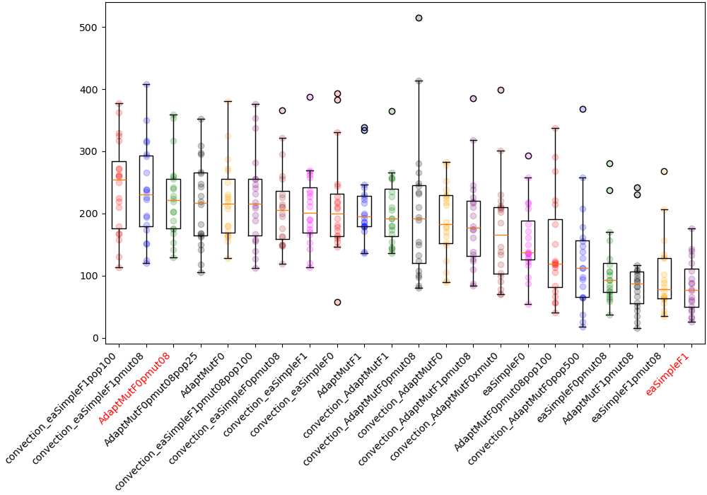

# **GECCO 2026: Automated Design Competition**

[Working Area](#working-area)

[Competition](#competition)

[Results](#results)

[Source Index](#source-index)

## Working Area

Instalation instructions: See [The competition page](https://www.framsticks.com/gecco-competition)
*Some folder paths are hardcoded, so you might have to edit some of the code*

**NotebookLM** for generating diagrams for the pptx

Baseline (adaptMut with default FramsticksEvolution): 286 MB (14.01% of RAM budget)

With pandas data collection for each evaluation:      462 MB (22.56% of RAM budget) \[+8.55%\]

[Competition website](https://www.framsticks.com/gecco-competition)
[GECCO competition link](https://gecco-2026.sigevo.org/Competition?itemId=8259)
[Disertation presentation slides](https://docs.google.com/presentation/d/1LQFmr2H28BHL-tTbk1Y-5kiM2AudMlV4DHNNDb9gkyQ/edit?usp=sharing)

**Notes**:

GOMEA - de vazut, algo puternic, complicat de implementat

de vazut AdaptMut

CMA-ES algo

Simulated Annealer

Riisto Miikkulainen - hyena simulation complexifying, diversity search

## TODO

* [x] Simple EA (TODO: more details here)
* [x] AdaptMut (Same as Simple EA, but stronger mutation)
* [x] Convection Selection (Island-based, split by fitness score)
* [ ] GOMEA ([2025 competition entry description here](https://www.framsticks.com/filebrowser/download/341) - it relies on f1)
* [ ] More EA variants: [(μ/ρ +, λ), (1+(λ, λ)), (μ, λ), (μ+λ), (μ+1), (1+1)](https://algorithmafternoon.com/strategies/mu_slash_rho_plus_lambda_evolution_strategy/), ...
* [ ] That speciation algorithm (niching by similarity, and encouraging explotration)
* [ ] Hyena for float tuning only?
* [ ] Investigate Building Block algorithms
* [x] Try AdaptMut Convection without `simplest genotype insertion` mutation
* [x] Variate popsize (25, 50, 100)
* [ ] Use the distance metric somehow?
* [ ] Smarter initialization (the first generation should already contain different individuals) - aka. don't evaluate the first generation (which is filled with the simplest genotype)
* [ ] Add an additional test map (some heightfield + water, instead of superflat) (**Is this worth it for the paper/algorithm?**)

**Questions**:

* [ ] Can I touch the **mutation operator**? It might have some `p_mutate_neurons` or `p_mutate_body` to fine-tune.
* [ ] Since the example experiment setup has randomness turned off, can I rely on that to be the case at evaluation time? Can I 'cheat' by **not re-evaluating genotypes which were seen before**?
* [ ] What could I change from the [2025 GOMEA entry](https://www.framsticks.com/filebrowser/download/341) to improve it?
  * I could substitute the island migrations for the Convection Selection Scheme
* [ ] What stats are interesting to compute? (average run fitness plot? average 'biggest fitness jump' generation? Plotting a GIF of the population over the run?)

## Competition

The competition concerns the development of an efficient algorithm to optimize active 3D designs (i.e., simulated agents or robots). The simulation environment is Framsticks, and participants have a Python binding available to the native simulator library, so algorithms should be implemented entirely in Python.

The goal of the competition is to propose an algorithm that will discover agents whose center of gravity moves in the desired way in different environments used during optimization. The properties of the desired movement are defined by the fitness function (unknown to participants); examples of such movements are: following a specific path in 3D, swinging or jumping.

The set of parameters that define each environment (such as gravity, water level, terrain, and initial agent rotation) is published, but their values will be set during the evaluation phase. Each submitted algorithm will be tested to optimize agents in 10 different settings (environments and desired movements). These settings will be the same for all participants.

 Environment parameters which are varied during the competition:
- lifespan of a creature ("starting energy" and "idle metabolism")
- world size and heightfield (map)
- water level
- gravity
- creature stabilization period settings
- creature body constraints (minimal and maximal joint length)
- complexity (Genotype length, Neuron count, Joint count, etc.)
The submitted algorithm should be single-process, single-threaded, no GPU. No more than one submission per participant is allowed.
**Max time: 1h**
**Memory: 2GB**
**Max fitness evaluations: 100k**
## Experiments
#### Setup

Unless specified otherwise, the default values are as follows:

*`pmut`*: 0.9 (mutation)

*`pxov`*: 0.2 (crossover)

*`selection`*: tournament with only feasible solutions (tournament size = 5)

*`crossover`*: ??? (handled by framsticks, probably single point crossover)

*`mutation`*: ??? (handled by framsticks)

*`popsize`*: 50

*`nislands`*: 10

*`reconvene_after`*: 10 (convection only)

*`genformat`*: F1

`when mutation or crossover is unable to perform its operation for the provided genotype(s), return the original genotype`

#### Results

> Highlighted in red are the baseline and the competition winner of the last 2 years.

## Source Index

*Sorted by relevancy. Notes about each source in the footnotes.*

**Framsticks specific**
* Maciej Komosinski [^frams-convection] [^frams-dissimilarity-new] [^gomea-buildingblocks-varlength] [^frams-f-genotype-comparison] [^frams-dissimilarity-bio] [^frams-ski]
* Other [^frams-comeptition-caspo]
Algorithms:
* QD [^qd-dissimilarity-crowding] [^qd-tensegrity-robots] [^qd-tensegrity-robots] [^qd-annealing]
* Hyena [^hyena-flowshop]
* GOMEA [^gomea-buildingblocks-varlength] [^gomea-buildingblock] [^gomea-romea] [^gomea-do-we-need] [^python-gomea] [^gomea]
* Building Blocks [^xover-building-block] [^gomea-buildingblocks-varlength] [^gomea-buildingblock]
* DE-NSGA [^qd-dissimilarity-crowding]
* PPO/RL [^hexacopters] [^rl-chinup] [^rl-evo-comparison]

Not reviewed [^qd-annealing] [^hyena-flowshop] [^NEAT] [^feasible-infeasible] [^gomea] [^qd-annealing] 
Other simulators [^qd-tensegrity-robots]
Very interesting [^gomea-buildingblocks-varlength] [^qd-dissimilarity-crowding]
Curiosities [^irl-robots] [^bullethell]
Well of papers: https://nn.cs.utexas.edu/?evolution
## Sources

[^frams-f-genotype-comparison]: [Comparison of Different Genotype Encodings for Simulated 3D Agents](http://www.framsticks.com/files/common/Komosinski_Encodings_ALifeJ2001.pdf) (Oct 2001, Artificial Life Journal)
	- #meta **pentru disertatie:** Sa pun la finalul introducerii un cuprins (section 2 contains ..., section 3 contains ..., and conclusions & future work in section 6)
	- genotype & phenotype impose different topologies on the search space - the more correlated they are, the better the results
	- **DESCRIBES THE FRAMESTICKS ENVIRONMENT & AVAILABLE BODY PARTS IN MORE DETAIL**
		- Neurons have slight variation to their inputs, to make them more robust & discourage reliance on specific patterns (aka. pay more attention to the environment)
		- f0 operators:
			- Mutation: alter properties, or (less frequently) add or remove a part
			- Crossover: Split the phenotype in 2 sections (use a cutting plane) and graft the sections between the parents
		- So the genetic operators really are already implemented, I COULD create my own representation, but I don't have to
	- #advice #deeper-subject Developmental encodings shown better for neural networks
		- #idea maybe implement modularity breakage for devel?
			- if a # node is selected for mutation, have an equal chance to modify the n-th or all repeated structures (1/(n+1) chance)
				- Would need a function to 'break' the repetition (shouldn't be too hard, he says)
		- Introduce |* * \*| nodes (start cyclic joint, continue cyclic joint, end .. so you can have spherical/circular structures (trompa lui eustachio))
	- #idea For simul: Maybe add a mutation operator to clone some part of the genotype, and append it recursively (like devel)
	- #idea how to force the discovery of inverse kinematics?
		- What would IK look like using framsticks neurons?
	- #advice **Bias in the genotypes is good actually** - search is more directed, even if the search space is smaller
	- #deeper-subject Genotype ideas: simul, recur, devel, cell-metabolysm, similarity-based
	- Good read, inspiring!

[^frams-dissimilarity-bio]:  [On Estimating Similarity of Artificial and Real Organisms](https://www.framsticks.com/files/common/Komosinski_Similarity_TheoryInBiosc2001.pdf) (Dec 2001, Theory in Biosciences)
	- #advice #stub-article control systems (neurons) are sophisticated, often coupled with morphology and very strongly connected functionally
	- #meta sections: overview, setup of concepts, meat, illustrative examples, discussion, future work
	- #meta reassure the reader that the new concepts will be expanded upon (specify where) in very close proximity to the new concept mention
		- So you don't go 2 paragraphs going `what the hell does Cnum mean?` confused
		- aka. mentioned `defined below` or `discussed in section 5`
	- #advice dissimilarity heuristic:
		- sort by node degree in the graph (nr neighbors), and try to match the nodes based on their info (num neurons, neuron connections, etc.)
			- compare starting with highest degree, so the most integral parts (read: thorax/main body) are more likely to be matched
		- a missing part is treated as a maximally dissimilar part to the one being currently compared to
	- A lot of biology terms to search up:
		cladistic - method of classifying organisms based on their evolutionary relationships, grouping them into clades that share a common ancestor
		phenetic - designating a system of classification of organisms based on analysis of a large number of quantifiable character traits, without consideration of evolutionary relationships.
		homology - similarity in anatomical structures or genes between organisms of different taxa due to shared ancestry, regardless of current functional differences.
		patristic - https://www.mun.ca/biology/scarr/Phenetic_Patristic_Cladistic.html
		phylogenetic - the study of the evolutionary history of life using observable characteristics of organisms
		epistasis - the phenomenon of gene interactions that affect the phenotype of an organism (example: bald gene supercedes the hair color gene)

[^NEAT]: [Evolving Neural Networks through Augmenting Topologies](https://nn.cs.utexas.edu/downloads/papers/stanley.ec02.pdf) (Jun 2002, MIT Press)
	- Risto Miikkulainen
	#tosee

[^feasible-infeasible]: [On a Feasible–Infeasible Two-Population (FI-2Pop) genetic algorithm for constrained optimization: Distance tracing and no free lunch](https://faculty.wharton.upenn.edu/wp-content/uploads/2013/03/genetic-algorithm-for-constrained-optimization_1.pdf) (Oct 2008, EJOR)
	#tosee 

[^frams-ski]: [Evolving free-form stick ski jumpers and their neural control systems](https://www.framsticks.com/files/common/Komosinski_Polak_EvolvedSkiJumping.pdf) (2009, Polish GECCO)
	-  #advice **The crossing over operator was not used** in this experiment; it is not particularly efficient when morphologies and control systems that are strongly coupled are evolved
	- the “creep” mutation was employed that adds a random number generated with the Gaussian distribution to the existing value.
	- 5000 agents is sufficient to observe convergence

[^irl-robots]: [Evolution of Adaptive Behaviour in Robots by Means of Darwinian Selection](https://journals.plos.org/plosbiology/article/file?id=10.1371/journal.pbio.1000292&type=printable) (Jan 2010, PLOS Biology)
	- real life robots
	- evolve neural net weights
	- #idea Have different mutation rates for body & brain (continuous function of frequency of body in top solutions)
	- small Neural Nets (~sensors x actions neurons)
	- experiments with predator-prey, evolve physical body configuration, foraging
	- #stub-article Possible future work: ontogenetic plasticity (evolve during lifetime)
		- Urzelai J, Floreano D (2001) Evolution of adaptive synapses: robots with fast adaptive behavior in new environments. Evol Comput 9: 495-524. 
		- Bongard J, Pfeifer R (2003) Evolving complete agents using artificial ontogeny. In: Hara F, Pfeifer R, eds. Morpho-functional Machines: The New Species: Designing Embodied Intelligence. Berlin: Springer-Verlag. pp 237–258.
	ontogeny - The origin and development of an individual organism from embryo to adult.

[^gomea-romea]: [Optimal Mixing Evolutionary Algorithms](https://dl.acm.org/doi/epdf/10.1145/2001576.2001661) (Jul 2011, GECCO)
	- mixing in genetic algorithms (GAs) and estimation-of-distribution algorithms (EDAs)
	- discuss the effect of the covariance build-up
	- Adding biases over the GA (so GOMEA,ROMEA) might lead to falling into traps. While the biases do help on the training functions, others might suffer greatly
	- #advice "EDA  thus converges about 20% faster than the GA"
	- Nu inteleg mai nimic
		- Pare prost facut: se repeta paragrafe, typos, ...
	- Ce e ala ECGA?
	- Use distance metric (for what?) = 1 − I(XF i ∪F j )/H(XF i∪F j ) = Scaled Variation of Information (VI/H)
		- This measure was also used in  the first GA that used the linkage tree structure to perform  variation, LTGA
	- #deeper-subject The univariate structure is found in various discrete EDAs such as UMDA, cGA and PBIL.
	- #advice Conclusion: **Use Linkage Tree GOMEA**

[^xover-building-block]: [How Crossover Speeds Up Building-Block Assembly in Genetic Algorithms](https://arxiv.org/pdf/1403.6600v2) (Nov 2014, ?)
	- **Mostly proofs**
	- Using crossover increases the optimal value of p_mutation
		- This is because introducing crossover makes neutral mutations more useful and larger mutation rates increase the chance of a neutral mutation.
	- recombination favours individuals that are good “mixers”
	- the population must be able to store individuals with different building blocks for long enough so that crossover can combine them
	- crossover generally reduces function evaluations in half
		- This holds provided that the parent population and offspring population sizes µ and λ are moderate, so that the inertia of a large population does not slow down exploitation
		- The reason for this speedup is that the GA can store a neutral mutation (a mutation not altering the parent’s fitness) in the population, along with the respective parent. It can then use crossover to combine the good building blocks between these two individuals, improving the current best fitness.
		- In other words, crossover can capitalize on mutations that have both beneficial and disruptive effects on building blocks.
	- #forgames speed of adaptation as a metric
	- royal roads = fitness function landscapes built to show the power of GAs
	- (μ+λ)-ES : popsize = μ -> generate λ offspring -> select best μ from joint population and continue (elitism)
		- A common rule of thumb is to set μ ≈ λ/7
	- #deeper-subject This left open the question whether k-point crossover is as effective as uniform crossover for assembling building blocks in ONEMAX. Here we provide a new and refined analysis, which gives an affirmative answer, under mild conditions on the crossover probability
	- #deeper-subject The **(1+(λ, λ)) EA** from \[[9](http://www.cmap.polytechnique.fr/~nikolaus.hansen/proceedings/2013/GECCO/proceedings/p781.pdf)\] shows that crossover can lower the expected running time by more than a constant factor.
		- Starting with one parent, it first creates λ offspring by mutation, with a random and potentially high mutation rate.
		- Then it selects the best mutant, and crosses it λ times with the original parent, using parameterized uniform crossover (the probability of taking a bit from the first parent is not always 1/2, but a parameter of the algorithm).
		- This leads to a number of O(n √ log n) expected function evaluations, which can be further decreased to O(n) with a scheme adapting λ according to the current fitness.
		- It uses a non-standard EA design because of its two phases of environmental selection.
		- Other differences are that mutation is performed before crossover, and mutation is not fully independent for all offspring: the number of flipping bits is a random variable determined as for standard bit mutations, but the same number of flipping bits is then used in all offspring.
	- #advice Try all the EA variants (λ, λ), (μ, λ), (μ+λ), ...
	- #advice Metric: We measure the performance of the algorithm with respect to the number of function evaluations performed until an optimum is found, and refer to this as optimization time
	- (µ+λ) EAs or (µ+λ) GAs: What's the difference?
	- the number of generations needed to optimize a fitness function can often be easily decreased by using offspring populations or parallel evolutionary algorithms

[^map-elites]: [Illuminating search spaces by mapping elites](https://arxiv.org/abs/1504.04909) (Apr 2015, ?)
	- Map out well performing solutions (defined in a high dimensional space) over some features of interest (cost, resource type used, etc.)
	- GA which remembers the best for each cell in a grid (grid of 2-3d, to be visualizable)

[^gomea-buildingblock]: [Scalable Genetic Programming by Gene-Pool Optimal Mixing and Input-Space Entropy-Based Building-Block Learning](https://dl.acm.org/doi/epdf/10.1145/3071178.3071287) (Jul 2017, GECCO)
	#toresee
	- GP-GOMEA: Algorithm has no parameters
	- Has a way to build library of best sub-solutions
	- Input-space Entropy-based Building-block Learning (IEBL)
		- Uses heuristics to identify BBs
			- I didn't understand how BBs are identified (Section 3.1)
		- #stub-article[Ramped half-and-half generation](https://www.researchgate.net/publication/220743001_Ramped_Half-n-Half_Initialisation_Bias_in_GP)
	- Interleaved Multistart Scheme - every g generations of the main GOMEA, run a generation of a pop_size\*2 GOMEA (global_best is global between populations)
	- GOMEA 1 + log10 (|pop_size|) = patience for improvement; afterwards introduce global_best into the donor pool
	- #advice Keep repository of all evaluated genotypes, to reduce amount of fitness evaluation
	- #advice Has a high-level GOMEA pseudocode

[^rl-evo-comparison]: [Evolution Strategies as a Scalable Alternative to Reinforcement Learning](https://arxiv.org/pdf/1703.03864) - (Sep 2017, ?)
	- Centers on comparison between Reinforcement Learning and Evolutionary Strategies, comparing runtime and data used
	-  Trust Region Policy Optimization ([TRPO](https://arxiv.org/pdf/1502.05477)) - lots of math

[^frams-convection]: [Tournament-Based Convection Selection in Evolutionary Algorithms](https://www.framsticks.com/files/common/TournamentBasedConvectionSelectionEvolutionary.pdf) (Mar 2018, LNCS)
	- Islands (QD like) separated by fitness ranges
	- #advice Diversity is very important
	- #advice some of the most popular selection strategies being tournament selection, ranking selection, proportional selection and sigma scaling
	-  a more complex, non-monotonic selection scheme can improve the performance of evolutionary algorithms
	- #deeper-subject Increased exploration can also be achieved in sequential evolutionary optimization using methods such as sharing or restricted mating. *Such methods require however calculating of additional measures of similarity*
	- Convection selection:
		- determine which individual should be assigned to which sub-population, but subpopulations still use regular selection
		- Every R generations: subpopulations > merge into one > perform operations > split into subpopulations
		- Otherwise:  apply steady-state (select one > mutate > add into subpopulation > remove random genotype from the entire population)
	-  https://www.framsticks.com/files/common/MultithreadedEvolutionaryDesign.pdf - original convection description (for multithreading)
	- #stub-article file:///home/xwiki/Downloads/SteadyState.pdf
		- Steady-state replaces only a few members in a generation (as opposed to replacing all members in a generation for Generational Reproduction)
		- #advice (personal opinion of the author) Exponential ranking is better than deleting least-fit
	- EqualNumber convection is best
		- #advice it is overtaken by simpleEA in the first generations though, since diversity is still building up
		- While the velocity criterion allows the algorithm to continuously improve the quality of solutions by **exploring new ideas** of “how to be fast” (i.e., more possibilities for exploration), the evolution of height quickly leads to a plateau, where the improvement can be achieved mostly by **fine-tuning of existing solutions** (“local optima”) that are easy to break
		- But the comparison graph is a bit unusual
	- #advice Future work: dynamic, adaptive strategies of splitting and merging subpopulations and recursion level

[^bullethell]: [Talakat: Bullet Hell Generation through Constrained Map-Elites](https://arxiv.org/pdf/1806.04718) (Jun 2018, GECCO)
	- MAP-Elites + Feasible-Infeasible Two-Population (FI-2Pop) genetic algorithm

[^frams-dissimilarity-new]: [A flexible dissimilarity measure for active and passive 3D structures and its application in the fitness–distance analysis](https://www.framsticks.com/files/common/DissimilarityMeasure3DStructuresFitnessDistance.pdf) (Mar 2019, LNCS)
	- like [^frams-dissimilarity-bio], but evolved
	- slightly over the previous greedy method, but more costly (i'm not sure if it's strictly better, but they seem to imply so)
	- Hungarian Algorithm for matching

[^qd-tensegrity-robots]: [Seeking Quality Diversity in Evolutionary Co-design of Morphology and Control of Soft Tensegrity Modular Robots](https://arxiv.org/pdf/2104.12175) (Apr 2021, ?)
	- Variants of MAP-Elites
		- [^double-MAP-E_1] 	
		- [^double-MAP-E_2]
		- ViE-NEAT
			- #deeper-subject ViE uses viability boundries
			- ViE for bodies population, NEAT for brains population, they get randomly paired at eval time
			- Brains are not dependent on body morphology, sensations are absolute (GPS position, angle from target)
		- DM-ME (best performance)
			- Automatic Feature detection: run PCA, automatically discretize the space; Update PCA when you get a phenotype outside of the previous generation's PCA boundary
			- PCA needs to re-evaluate all solutions when it is updated. EXPENSIVE!!!
			- PCA only for the NN, for bodies use user-defined metrics
			- PCA is done on the trajectory of the robot
			- Population of body-brain pairs
		- Time : ViE < DM-ME < MAP-Elites

[^gomea]: [Parameterless Gene-pool Optimal Mixing Evolutionary Algorithms](https://arxiv.org/pdf/2109.05259) (Sep 2021, ?)
	#tosee 

[^hyena-flowshop]: [Hybrid Genetic and Spotted Hyena Optimizer for Flow Shop Scheduling Problem](https://www.mdpi.com/1999-4893/16/6/265) (May 2023, ?)  [local file link](file:///home/xwiki/Downloads/algorithms-16-00265-v2.pdf)
	#tosee

[^python-gomea]: [A Joint Python/C++ Library for Efficient yet Accessible Black-Box and Gray-Box Optimization with GOMEA](https://arxiv.org/pdf/2305.06246) (May 2023, GECCO)
	- Ok introduction to GOMEA
	- Is only a Python wrapper on C++ GOMEA

[^qd-annealing]: [Covariance Matrix Adaptation MAP-Annealing](https://arxiv.org/pdf/2205.10752) (Jun 2023, GECCO)
	#tosee

[^frams-comeptition-caspo]: [Automated Design Competition Technical Report: Cascaded Structure and Parameter Optimization Based on Prior Knowledge](https://dl.acm.org/doi/epdf/10.1145/3638530.3664054) (Jul 2024, GECCO)
	- Steps: LLM init > Body + Brain EA > Brain EA > Parameter Tuning > goto EA

[^hexacopters]: [Unconventional Hexacopters via Evolution and Learning: Performance Gains and New Insights](https://arxiv.org/html/2505.14129v1) (May 2025, ? EU Grant)
	- GA represents morphologies > each morphology gets a controller through Reinforcement Learning > Compute fitness
	- Proximal Policy Optimization (actor-critic) for RL
	- Evolved morphologies were better on the tasks they were trained on than human designs
	- #advice The metrics developed to characterize learning dynamics (burn-in time, learning speed, volatility, and maximum reward)

[^gomea-do-we-need]: [A Better Multi-Objective GP-GOMEA - But do we Need it?](https://dl.acm.org/doi/epdf/10.1145/3712255.3734302) (Jul 2025, GECCO)
	- Based on our findings, we recommend using SO optimization with an MO elitist archive in GP, particularly when using GP-GOMEA, as a first step for most scenario
	- Explainable AI
	- 👎

[^gomea-buildingblocks-varlength]: [GOM-Based Compatible Substitutions Optimization for Variable-Length Representation Gray-Box Problems](https://dl.acm.org/doi/pdf/10.1145/3712255.3726717) (July 2025, GECCO)
	- this is really good
	- CoSO : Use GOM for var length genomes
	- ?Store a library of elite solutions, to identify later the building blocks, rate how well they can be grafted into a solution
	- Substitution Compatibility Function (SCF):
		- The substitution should serve the same purpose (replace a leg with another type of leg)
		- How much the substitution impacts the way the genotype is turned into phenotype (invalid links, etc)
		- *One of the weaknesses of the proposed𝑆𝐶𝐹 function is its struggle to modify the distance between two substructures in a structure, and its inability to change the parity of the length of the genotype*
		- Added term to prevent entirely replacing solutions (since a solution could also be considered a sub-solution)
	- Once a generation is over (no substitutions are available anymore), the current generation is marked as elites library, and a new population is initialized randomly
	- Matching subsolutions from the current population might be hindering the search
	- best performance with popsize=1 (so it is a vessel, ripe for experimenting with already learned elite library subsolutions)
	- Should have small size of the library
	- CoSO(in1, in2) -> compatibility score of some subsolution
	- Introduced random noise so angles aren't perfect -> more robust/realistic (90deg is actually 89.97~91.2deg, for example)
	- Future Work:
		- Train the SCF based on data obtained during the search
		- Use elite sub-solution library instead of elite solution library

[^qd-dissimilarity-crowding]: [Enhancing Quality-Diversity Optimization Through Domain-Specific Dissimilarity as Crowding Distance](https://dl.acm.org/doi/pdf/10.1145/3712256.3726459) (Jul 2025, GECCO)
	- #deeper-subject NSGA-II
		- sort by rank in population (when sorted by ???)
		- use crowding distance to encourage outliers to reproduce
	- DE-NSGA-II introduced here had better diversity, but lower fitness
	- Other ways to address premature convergence:
		- Niching (penalty for similar solutions)
			- #stub-article Non-dominated Sorting Genetic Algorithm II
		- Novelty search (fitness is novelty, not fitness function)
		- QD variants: novelty search (NSLC) or MAP-elites
			- #deeper-subject QD for Games content generation mentioned
	- Something like [^frams-dissimilarity] is mentioned

[^rl-chinup]: [Evolutionary Continuous Adaptive RL-Powered Co-Design for Humanoid Chin-Up Performance](https://arxiv.org/html/2509.26082v1) (Sep 2025, ?)
	- #toresee
	- CMA-ES for EA part
	- RL in inner loop (Markov decision process, aka regular RL (state, action, probability, reward, discount))
		- Proximal Policy Optimisation for RL

### Disregard

[^book]: [Artificial Life Models in Software](https://pdfs.semanticscholar.org/8676/268ac4320c8fb9baf5200fd86f9c26ab79b5.pdf) (2009, ?)
	- Carte, nu prea am timp de ea
	#toresee 

[^double-map-e_2]: [Quality Diversity: A New Frontier for Evolutionary Computation](https://www.frontiersin.org/journals/robotics-and-ai/articles/10.3389/frobt.2016.00040/full) (Jul 2016, ?)
	- #stub-article 

[^double-map-e_1]: [Open-ended evolution with multi-containers QD](https://dl.acm.org/doi/10.1145/3205651.3205705) (Jul 2018, GECCO)
	- #stub-article
	- Generate MAP-E maps on the fly, based on behavior types (flying map for flying agents, etc)
	- Novelty Search + local competition

[^hyena-llm]: [HyenaDNA: Long-Range Genomic Sequence Modeling at Single Nucleotide Resolution](https://arxiv.org/pdf/2306.15794) (Nov 2023, ?)
	- NN/LLM, DISREGARD

[^maciej-physics]: [On the influence of design parameters on the performance of the dielectric elastomer actuator with a permanent magnet](https://www.nature.com/articles/s41598-025-21993-5?error=server_error) (Oct 2025, ?)
	- Maciej
	- Looks like more of a physiscs experiment, so ignore; no GA
